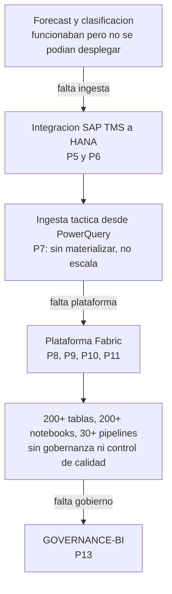
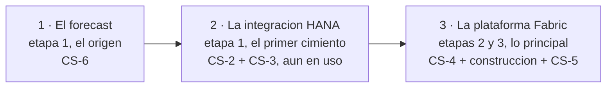

# Content & Positioning Extraction

**Estado:** Fase 2. Documento de trabajo, escrito para que lo discutas y lo corrijas.
**Fuentes:** [content-interview.md](content-interview.md) (tus respuestas, septiembre de 2026) y los seis documentos de la auditoría de agosto de 2026.
**Fecha:** 17 de septiembre de 2026.

Este documento no contiene copy de la web. Su único objetivo es convertir la
información de `content-interview.md`, que está organizada como *lo que hice*,
en algo que se pueda usar para construir un portfolio:

```text
experiencia → evolución → capacidades → criterio → posicionamiento → historias
```

Lo que sí hace: extraer lo que ya está demostrado, inferir qué patrones
profesionales aparecen en la trayectoria, y dejar por escrito qué falta todavía.
Lo que no hace: escribir los case studies, decidir el copy, ni redefinir la
arquitectura de información, que ya existe en
[v2-information-architecture.md](v2-information-architecture.md).

---

## 0. Cómo leer este documento

Los documentos de la auditoría etiquetan cada afirmación como FACT, ASSESSMENT,
RECOMMENDATION o HUMAN INPUT REQUIRED. Aquí uso las etiquetas equivalentes en
español, para que los dos conjuntos se puedan leer juntos sin confusión:

| Etiqueta | Equivalente en la auditoría | Significa |
|---|---|---|
| **HECHO** | FACT | Lo dijiste tú en `content-interview.md`, o está verificado en el repositorio. Si un HECHO está mal, el documento está mal. |
| **INFERENCIA** | ASSESSMENT | Mi lectura de lo que significan esos hechos. Discutible por definición, y escrita para que la discutas. |
| **PROPUESTA** | RECOMMENDATION | Algo que propongo decidir así. Ni acordado ni ejecutado. |
| **PENDIENTE** | HUMAN INPUT REQUIRED | Información que solo tienes tú. Deliberadamente en blanco en lugar de inventada. |

Dos advertencias sobre el uso de las etiquetas en este documento concreto.

La primera: **la sección 5 es casi toda INFERENCIA, y es la más importante.** Es
la que convierte una lista de proyectos en un perfil profesional, y es también
donde más fácil me resulta equivocarme, porque estoy interpretando tu
trayectoria a partir de un único documento. Si solo vas a revisar dos secciones
a fondo, que sean la 5 y la 7.

La segunda: **no he inventado ni un número.** Dijiste que no querías métricas
forzadas y estoy de acuerdo, así que la credibilidad la sostiene otra cosa —
el nivel de madurez de cada cosa que construiste, que es tu propia idea y está
explicada en la sección 3.

---

## 1. Narrativa profesional

### 1.1 La versión corta

**HECHO.** El resumen mínimo, solo con lo que está en `content-interview.md`:

> Químico de formación, reorientado a datos mediante un posgrado en inteligencia
> de negocio y un bootcamp de programación. Entró en enero de 2024 en el equipo
> de Business Intelligence de una cadena hotelera como Data Scientist, en su
> primer trabajo del sector. Empezó experimentando con modelos de previsión sin
> plataforma donde desplegarlos, siguió construyendo la ingesta de datos que
> faltaba, después la plataforma analítica completa sobre Microsoft Fabric, y
> ahora el sistema de gobierno de esa plataforma. Título actual: Integration
> Specialist, en un área de Data transversal.

**INFERENCIA.** Esa es la secuencia de hechos, y no es todavía una narrativa.
Una narrativa elige un eje. Los mismos hechos admiten al menos cuatro, y la
elección no es cosmética: cambia qué proyectos son protagonistas, qué tipo de
lector se interesa, y qué preguntas te van a hacer en una conversación.

### 1.2 Cuatro encuadres posibles

#### Encuadre A — El giro

> *"Vengo de la química y acabé construyendo plataformas de datos."*

**Sostiene:** el grado en Química (UB, 2021), el posgrado (UOC, 2023), el
bootcamp (Fundació Esplai, 2023), y tu propia frase: *"nunca había trabajado
como Data/Developer, pero resultó que todo este mundo me resultaba muy
interesante y me apasionaba"*.

**Le habla a:** el lector humano. Es la parte memorable de tu historia.

**Riesgo.** Es el encuadre del portfolio de 2023, y ya entonces era el eje.
[content-audit.md](content-audit.md) §0 concluye que el sitio actual describe
"a una persona distinta": alguien que acababa de reciclarse y aún no había
trabajado en el sector. Repetir este eje en 2026 mantiene el centro de gravedad
en el pasado y en la formación, que es exactamente el problema diagnosticado.

#### Encuadre B — La curva de madurez

> *"Entré en un equipo de datos cuando todavía se experimentaba con CSVs, y me
> tocó construir cada capa que faltaba: la ingesta, la plataforma y el
> gobierno."*

**Sostiene:** las tres etapas de `content-interview.md` §3, en orden. Etapa 1:
experimentos de ML sin sistema de ingesta, trabajando *"con csv o similar"*.
Etapa 2: elección y construcción de la plataforma. Etapa 3: migración a escala y
gobierno de una plataforma con *"200+ tablas, 200+ notebooks, 30+ pipelines"* que
*"estaba sin gobernanza ni control de calidad"*.

**Le habla a:** el lector técnico y el reclutador a la vez. Es una progresión
legible sin conocer el sector.

**INFERENCIA.** Este es el encuadre más fuerte que tienes, por una razón
concreta: es raro. La mayoría de los perfiles se incorporan a una función de
datos que ya está en una etapa concreta y se quedan ahí. Tú recorriste la curva
entera — experimentación, ingesta, plataforma, gobierno — en dos años y siete
meses, y en buena parte la condujiste. Eso normalmente lleva cinco años y tres
empresas distintas.

**Riesgo.** Mal contado suena a "hice un poco de todo". Necesita que las etapas
se vean como una progresión con causas, no como una lista.

#### Encuadre C — El puente entre el SAP empresarial y el lakehouse moderno

> *"Trabajo en la frontera entre el SAP que una empresa ya tiene y la plataforma
> analítica que quiere tener."*

**Sostiene:** SAP TMS, MM, BW, HANA Cloud y BTP por un lado; Microsoft Fabric,
PySpark, arquitectura medallón y Lakehouse por el otro. Y, sobre todo, el hecho
de que construiste los dos puentes: la sincronización TMS → HANA con FlowGraph y
procedures, y la ingesta HANA/BW → Fabric.

**Le habla a:** el lector técnico especializado, y a cualquier empresa que tenga
SAP y esté intentando modernizar su analítica, que son muchísimas.

**INFERENCIA.** Es tu diferenciador más escaso, y creo que no lo has formulado
nunca así. La gente que sabe de Fabric no suele saber de HANA, BW, TMS ni BTP.
La gente que sabe de SAP no suele escribir PySpark. Tú haces las dos cosas, y lo
demuestran cuatro sistemas en producción, no un curso.

**Riesgo.** Es el encuadre más nicho. Te ancla a un ecosistema concreto, y si
algún día quieres salir del mundo SAP, es la etiqueta que más cuesta quitarse.

#### Encuadre D — El que baja al cimiento

> *"Tres veces me encontré con que lo interesante estaba bloqueado por algo que
> faltaba más abajo, y las tres veces bajé a construirlo."*

**Sostiene:** el forecast de ocupación funcionaba y no se pudo desplegar porque
*"no existía una plataforma/sistema preparado para implementar el forecast"*; la
respuesta fue irse a integración de datos. La ingesta táctica desde PowerQuery
*"no era óptima"* y la respuesta fue la plataforma. La plataforma creció *"sin
gobernanza ni control de calidad"* y la respuesta fue el sistema de gobierno.

**Le habla a:** cualquier ingeniero con experiencia. Es un patrón de criterio
que se reconoce al instante.

**Riesgo.** Es el más difícil de contar en una sola línea, y si se cuenta mal
suena a que abandonaste el data science por falta de opciones en lugar de por
criterio.

### 1.3 Lo que propongo

**PROPUESTA.** No elegir uno, sino asignarles papeles distintos:

- **B es la columna vertebral.** Estructura el Experience y el orden de los case
  studies, porque es lo único que explica por qué tu trabajo cambió tres veces
  de naturaleza.
- **C es la frase técnica.** Es lo que va en el hero y en las etiquetas de
  tecnología, porque es lo más difícil de encontrar en otra persona.
- **D es el carácter.** Es lo que hace que un case study se lea como criterio y
  no como currículum. Vive dentro de las historias, no en un titular.
- **A se reduce a una línea.** En el timeline y en el About, en primera persona.
  Sigue siendo interesante; ya no es el titular.

**HECHO — respondido en la segunda ronda.** Elegido el **encuadre B**, la curva
de madurez, como columna vertebral. Los papeles de C, D y A quedan como se
proponen arriba.

---

## 2. Timeline de carrera

### 2.1 Cronología normalizada

**HECHO.** Todo lo que sigue está en `content-interview.md`, salvo las tres
primeras filas, que vienen de [content-audit.md](content-audit.md) §0 (extraídas
del contenido del sitio actual).

| Fecha | Hito | Detalle |
|---|---|---|
| Julio 2021 | Grado en Química | Universitat de Barcelona |
| Julio 2023 | Posgrado en Inteligencia de Negocio y Análisis de Datos | UOC. Formación orientada a la parte de Data |
| Septiembre 2023 | Bootcamp de competencias tecnológicas en IA & Machine Learning con Python | Fundació Esplai, 500 horas. Formación orientada a programación y desarrollo |
| Jul–dic 2023 | Primera versión de este portfolio | 46 commits, último el 23/12/2023 |
| **29 enero 2024** | **Entrada en Catalonia Hotels & Resorts** | Data Scientist, equipo de Business Intelligence. Contratado por Hola Consultores, en exclusiva para Catalonia como empresa cliente |
| ~enero/febrero 2025 | Fin de la etapa 1 | Estimado a partir de "unos 12 meses" |
| **3 junio 2025** (aprox.) | **Internalización** | Pasas a plantilla de Catalonia. Mismo rol y equipo |
| Finales de 2025 | Cambio en la dirección de la empresa | Empresa familiar; otra rama asume la dirección |
| ~diciembre 2025 / enero 2026 | Fin de la etapa 2 | Estimado a partir de "entre 9 y 12 meses" |
| **Principios de 2026** | **Nueva dirección de IT y cambio de rol** | Pasas a Integration Specialist, en un área de Data transversal. Reorganización: de áreas (Web, BI, SAP, HANA) a proyectos y mantenimiento |
| Hoy (septiembre 2026) | Etapa 3 en curso | Data engineering, migración BW → Fabric, gobierno del dato |

**PENDIENTE.** Tres fechas sin cerrar, ninguna bloqueante:

1. La fecha exacta del cambio a Integration Specialist. Tú mismo la marcaste
   como *"falta fecha exacta"*.
2. La fecha exacta de la internalización, que anotaste como aproximada.
3. Si el cambio de rol y el cambio de CIO fueron simultáneos o hubo semanas o
   meses de diferencia.

### 2.2 Las etapas, situadas en el tiempo

**INFERENCIA.** En `content-interview.md` las etapas vienen con duración pero sin
fechas. Situándolas y comprobando la aritmética: 12 meses + 9 a 12 meses + 6 a 9
meses da entre 27 y 33 meses, y desde el 29 de enero de 2024 hasta hoy han
pasado 31,6. Encaja con los valores centrales del rango, así que las tres
duraciones son mutuamente consistentes y no hay un periodo sin contar.

```mermaid
flowchart LR
    subgraph e1 ["Etapa 1 (ene 2024 - ene 2025)"]
        direction TB
        e1a["Formacion y setup<br/>logica de negocio y plataformas"]
        e1b["Experimentacion<br/>RoomTetris, forecast, cancelaciones"]
        e1c["Integracion<br/>SAP TMS a HANA, eventos en BTP"]
        e1a --> e1b --> e1c
    end
    subgraph e2 ["Etapa 2 (feb 2025 - dic 2025)"]
        direction TB
        e2a["POCs<br/>dos consultoras, dos plataformas"]
        e2b["Decision: Fabric"]
        e2c["Construccion<br/>arquitectura medallon"]
        e2a --> e2b --> e2c
    end
    subgraph e3 ["Etapa 3 (ene 2026 - hoy)"]
        direction TB
        e3a["Data engineering<br/>migracion BW a Fabric"]
        e3b["Nuevos modelos<br/>RFM, CLV, Customer 360, Rewards"]
        e3c["Gobierno<br/>GOVERNANCE-BI, docs as code, IA"]
        e3a --> e3b --> e3c
    end
    e1c --> e2a
    e2c --> e3a
```



**INFERENCIA.** Hay una coincidencia que merece la pena señalar porque ordena la
narrativa: **el inicio de la etapa 3, el cambio de CIO y tu cambio de rol caen
en el mismo punto**, a principios de 2026. La reorganización del departamento
(de áreas a proyectos y mantenimiento, con Data como área transversal) y el
cambio de prioridades (*"mejorar calidad, reducir errores e incidencias,
optimizar procesos"*) son exactamente el contexto que explica por qué te pusiste
a construir gobierno del dato. No fue una iniciativa aislada: fue la respuesta
correcta a un cambio de estrategia. Contado así, deja de ser "además hice
documentación" y pasa a ser "leí hacia dónde iba el departamento y construí la
pieza que faltaba".

### 2.3 Cómo formular la antigüedad

**HECHO.** Del 29 de enero de 2024 al 17 de septiembre de 2026 hay **dos años y
siete meses**. En enero de 2027 serán tres años.

**INFERENCIA.** El brief original decía "around three years of professional
experience", que redondea hacia arriba. No es grave, pero el portfolio es
precisamente el sitio donde no conviene redondear hacia arriba, porque es
verificable en LinkedIn en cinco segundos y porque
[v2-vision.md](v2-vision.md) §6 pone la honestidad por construcción como
principio.

**PROPUESTA.** No poner una duración calculada en ningún sitio. Poner la fecha
de inicio: *"en Catalonia Hotels & Resorts desde enero de 2024"*. Tres ventajas:
es exacto, se actualiza solo, y responde al "staleness test" de
[v2-vision.md](v2-vision.md) §8, que pregunta si el sitio seguiría siendo
correcto dos años sin tocarlo. Una duración escrita a mano envejece; una fecha
de inicio no.

### 2.4 Cómo presentar los dos contratos

**HECHO.** Trabajaste en el mismo sitio, para el mismo cliente y en el mismo
equipo desde el primer día, pero con dos empleadores legales: Hola Consultores
de enero de 2024 a junio de 2025, y Catalonia Hotels & Resorts desde entonces.

**INFERENCIA.** Hay tres formas de contarlo y cada una tiene un coste:

| Opción | Qué gana | Qué pierde |
|---|---|---|
| Dos entradas separadas de empleador | Máxima exactitud formal | Parece un cambio de trabajo que no existió, y fragmenta una trayectoria continua en dos trozos de 17 y 15 meses |
| Una entrada de Catalonia, con dos filas de rol y una nota sobre el contrato inicial | Refleja la continuidad real del trabajo y sigue siendo exacto | Requiere una línea de explicación |
| Una entrada de Catalonia, sin mencionar la consultora | Lo más limpio de leer | Omite un hecho verificable en LinkedIn, y la incoherencia resta más de lo que suma la limpieza |

**PROPUESTA.** La segunda. Un bloque de Catalonia Hotels & Resorts desde enero
de 2024, con dos filas de rol (Data Scientist → Integration Specialist) y una
nota corta del tipo *"inicialmente a través de Hola Consultores, en exclusiva
para Catalonia"*. Es habitual en el mercado español, se entiende en una línea, y
el paso a plantilla es en sí mismo una señal positiva que conviene no esconder.

**PENDIENTE.** Si estás de acuerdo, y si quieres que el paso a plantilla se lea
como hito (*"internalizado en junio de 2025"*) o solo como cambio de contrato.

---

## 3. Inventario de proyectos

### 3.1 Los dos ejes de clasificación

**PROPUESTA.** Tu distinción entre experimentos, desarrollos que llegaron a
producción y sistemas que se siguen usando pasa de ser un comentario al margen a
ser el criterio principal de clasificación del inventario. La razón es que
resuelve el problema que planteaste: sin métricas, hace falta *algo* que separe
"lo probé" de "lo usa la empresa todos los días", y el nivel de madurez lo hace
sin inventar un solo número.

**Eje 1 — Madurez:**

| Etiqueta | Significa |
|---|---|
| **EXPERIMENTO** | Prueba de concepto o exploración. Aportó conocimiento y criterio; no quedó en uso. |
| **PRODUCCIÓN** | Llegó a funcionar de forma estable y se usó para el trabajo real. Algunos después se sustituyeron por algo mejor, lo cual no los invalida. |
| **EN USO Y CRECIENDO** | Sigue en funcionamiento hoy y se sigue construyendo encima. Es el nivel más alto de evidencia que tienes. |
| **DECISIÓN** | El entregable no fue código, sino una evaluación y una elección. |

**Eje 2 — Propiedad.** Necesario porque
[v2-vision.md](v2-vision.md) §5 señala que el lector técnico detecta al instante
un alcance inflado, y porque decir "lo hice yo" cuando había un equipo detrás
cuesta más credibilidad de la que gana:

| Etiqueta | Significa |
|---|---|
| **TUYO** | Lo diseñaste y lo construiste tú. |
| **TUYO + COLABORACIÓN** | Tú la parte principal, con apoyo puntual de otro equipo. |
| **CON PROVEEDOR** | Una consultora participó; tú dirigías, seguías y completabas. |
| **COMPARTIDO** | Decisión o trabajo de equipo, con contribución tuya identificable. |

### 3.2 Inventario profesional

**HECHO.** Trece bloques de trabajo, extraídos de `content-interview.md` §3. El
identificador (P1–P13) es solo para poder referenciarlos en las secciones
siguientes.

#### Etapa 1 — Experimentación e integración (ene 2024 – ene 2025)

**P1 · RoomTetris — asignación óptima de habitaciones**
Madurez: EXPERIMENTO · Propiedad: TUYO
Algoritmo en Python para asignar habitaciones optimizando la ocupación, a
petición del subCIO a partir de un artículo sobre una empresa surgida de un
doctorado. Funcionaba, y la complejidad creció al añadir variables:
tipos de habitación, número de personas, duraciones, preferencias del cliente,
rangos del programa de fidelización, excepciones VIP. Requirió optimizaciones
para no explorar todo el espacio de combinaciones. Abandonado por coste/beneficio
frente a soluciones comerciales y por alejarse del rol.
*Demuestra:* diseño de algoritmos, optimización combinatoria, gestión de
complejidad creciente y criterio para cerrar una vía.

**P2 · Forecast de ocupación a 30/60/90 días**
Madurez: EXPERIMENTO · Propiedad: TUYO
**Tu primer gran proyecto**, y el más alineado con el rol oficial. Comparativa
amplia: Random Forest, Gradient Boosting, XGBoost, LightGBM, CatBoost; LSTM y
GRU; ARIMA y SARIMA; y regresión lineal, Ridge y Lasso. Ganaron los modelos de
regresión, a cambio de más transformación de datos y mejor análisis previo de
variables. La clave fue usar las reservas ya hechas a futuro como variable
adelantada. No se desplegó, por dos motivos y no uno: no había plataforma ni
ingesta automatizada donde implementarlo, y **cambiaron las prioridades** de la
empresa.
*Demuestra:* ML aplicado con comparativa honesta, ingeniería de variables con
indicador adelantado, y capacidad de diagnosticar por qué algo que funciona no
se puede poner en producción.

**P3 · Clasificación de reservas: cancelación probable**
Madurez: EXPERIMENTO · Propiedad: TUYO
Mismo repertorio de modelos, aplicado a predecir si una reserva futura se
cancelará. Resultados peores que el forecast. Diagnóstico propio: al ser una
clasificación a nivel de reserva y no de hotel, faltaban muchos datos por
integrar. Abandonado por la misma razón de fondo: *"nos estábamos saltando
pasos"*.
*Demuestra:* saber leer por qué un modelo no rinde en términos de granularidad y
disponibilidad de datos, en lugar de insistir con más modelos.

**P4 · SAP TMS → HANA con Python y API propia**
Madurez: EXPERIMENTO (POC descartada) · Propiedad: TUYO
Primera aproximación a la integración: mover datos de SAP TMS a HANA con Python
y una API a medida. Descartada por mantenibilidad y escalabilidad.
*Demuestra:* evaluar tu propia solución con criterio de mantenimiento y
descartarla antes de que se convierta en deuda.

**P5 · SAP TMS → HANA con FlowGraph y procedures**
Madurez: EN USO Y CRECIENDO · Propiedad: TUYO + COLABORACIÓN (equipo de TMS)
La solución que funcionó, y el primer éxito claro de la etapa. Cargas FULL para
maestros e inicializaciones y DELTA para las incrementales, con detección de
borrados en origen marcando el último tipo de cambio de cada registro: `I`, `U`
o `D`. Método: vistas mirror del origen, tablas temporales para el incremental y
tablas réplica materializadas en HANA, comparando unas con otras para detectar
los cambios; procedures orquestando todo el proceso. Tú la parte de HANA; el
equipo de TMS marcó los timestamps y creó las vistas mirror.
**HECHO — segunda ronda.** Dos precisiones importantes. La primera: **esto sigue
siendo la base de la plataforma HANA hoy**, junto con P6, motivo por el cual la
madurez sube de PRODUCCIÓN a EN USO Y CRECIENDO. La segunda, de alcance: **no te
involucraste en la creación de las vistas para consumir los datos**. Tu límite
era la ingesta y la sincronización.
*Demuestra:* captura de cambios (CDC) diseñada a mano, con detección de borrados
y orquestación propia. Es la pieza técnicamente más sólida de la etapa 1.

**P6 · Detección y notificación de eventos de negocio**
Madurez: EN USO Y CRECIENDO · Propiedad: TUYO
Construido encima de P5: aprovechando que el dato incremental ya pasaba por una
vista temporal, se añadió un paso para detectar eventos de negocio (creación de
reserva, cancelación, alta de cliente) y registrarlos en una tabla de eventos en
HANA. En SAP BTP, unas APIs activadas desde HANA leen esa tabla y las auxiliares
de suscriptores, y notifican a los consumidores: colas de GCP y similares. Desde
entonces se han ido añadiendo más eventos y más suscriptores.
*Demuestra:* arquitectura orientada a eventos con publicación y suscripción,
diseñada para extenderse sin rehacerse. Y lo más valioso: **lo siguen ampliando,
que es la mejor prueba posible de que el diseño era bueno.**

**P7 · Consumo de APIs desde PowerQuery con scripts en M**
Madurez: PRODUCCIÓN (sustituido después) · Propiedad: TUYO
Integración de las APIs de ReviewPro y Takhys directamente desde PowerQuery para
consumirlas en Power BI. Reconocido como solución temporal desde el principio:
muchas llamadas, datos en memoria, sin materialización. Migrado después a Fabric.
*Demuestra:* resolver una necesidad inmediata con una solución que sabes
provisional, y documentar por qué lo es. Es un buen ejemplo de pragmatismo con
los ojos abiertos.

#### Etapa 2 — Plataforma (feb 2025 – dic 2025)

**P8 · POCs y elección de plataforma de datos**
Madurez: DECISIÓN · Propiedad: COMPARTIDO (seguimiento y criterio técnico tuyos)
Dos POCs con doble objetivo: elegir consultora para proyectos de data
engineering y data science, y elegir plataforma. Cada consultora representaba una
opción: Google Cloud Platform y Microsoft Azure. Tu papel fue el seguimiento de
ambos proyectos y resolver sus dudas. Ambas desarrollaron un forecast de
ocupación, comparado con el tuyo de la etapa 1 como línea base: **ninguna de las
dos lo superó**. La consultora que más gustó fue la de GCP; la plataforma que
encajaba mejor era Fabric. Se eligió Seidor, explícitamente por la plataforma y
no por la consultora. En paralelo, ya venías investigando GCP, Databricks y
Fabric por tu cuenta.
*Demuestra:* evaluación tecnológica comparada, uso de tu propio trabajo como
línea base, y separar la preferencia personal del criterio de decisión. Este
último punto es más raro de lo que parece.

**P9 · Construcción de la plataforma en Fabric**
Madurez: EN USO Y CRECIENDO · Propiedad: TUYO + CON PROVEEDOR
Arquitectura medallón — BRONZE, SILVER y GOLD — con un Lakehouse por capa,
dividido en esquemas y tablas, y tres workspaces: DEV, QA y PRO. Desarrollo casi
todo en PySpark, algo de Python, y T-SQL para consultas y validaciones. La
aportación de Seidor fue un sistema de ingesta desde SAP HANA y parcialmente
desde SAP BW, configurable mediante un Excel. La capa de transformación la
asumiste tú, porque requería conocimiento de negocio y de los datos que la
consultora no tenía. Tu tarea fue doble: dirigir y seguir su proyecto, y
desarrollar la mayor parte de la plataforma.
*Demuestra:* arquitectura lakehouse multicapa, gestión de entornos, PySpark y
T-SQL a escala, y dirección técnica de un proveedor.

**P10 · Integraciones de APIs en Fabric**
Madurez: PRODUCCIÓN · Propiedad: TUYO
Con Fabric disponible, integraciones propias con las APIs de ReviewPro y Takhys,
con cargas diarias, semanales y mensuales que alimentan informes y dashboards de
Power BI. La ventaja sobre P7: histórico completo guardado y datos limpios.
*Demuestra:* ingesta desde APIs de terceros con historificación, y la mejora
medible respecto a la solución táctica anterior.

#### Etapa 3 — Escala y gobierno (ene 2026 – hoy)

**P11 · Migración SAP BW → Fabric y nuevos modelos de datos**
Madurez: EN USO Y CRECIENDO · Propiedad: TUYO
El grueso del desarrollo restante tras la salida de Seidor. Terminar lo empezado,
migrar datos de SAP BW a Fabric (la parte de HANA estaba más avanzada) y crear
modelos nuevos para informes nuevos: análisis de emails, RFM, Customer Lifetime
Value, Customer 360 y Rewards.
*Demuestra:* migración de un almacén legado, modelado analítico orientado a
negocio, y sostener una plataforma en crecimiento como desarrollador principal.

**P12 · Integración de datos de marketing con Deloitte**
Madurez: PRODUCCIÓN · Propiedad: CON PROVEEDOR (dirección tuya)
Proyecto con Deloitte para integrar datos de Emarsys y GCP relacionados con
marketing y campañas: emails, clicks, opens.
*Demuestra:* dirección de un segundo proveedor, e integración de datos entre
nubes distintas.

**P13 · GOVERNANCE-BI — gobierno del cambio en Fabric**
Madurez: EN USO Y CRECIENDO (V1) · Propiedad: TUYO
El proyecto más reciente y el más singular. Contexto: Fabric había llegado a
*"200+ tablas, 200+ notebooks, 30+ pipelines"* **sin gobernanza ni control de
calidad**, justo cuando la nueva dirección de IT priorizaba calidad, reducción
de incidencias y optimización de procesos. Dos repositorios en Azure DevOps: uno
para Fabric con una rama por workspace (DEV, QA, PRO) y otro, GOVERNANCE-BI,
donde la documentación se trata como código.

La pieza central es la *Release Entry*: registra qué cambio se hace, qué assets
afecta y qué documentación se relaciona. Alrededor de ella, cuatro roles
(Developer, Reviewer, Releaser, Maintainer) y varias capas: Rules & Evidence con
severidad blocker o warning, Approvals como acta formal, CHANGELOG y Release
Notes para la trazabilidad, inventario de lo que realmente existe en PRO y
cuánto está documentado, documentación funcional de modelos, pipelines y libs, y
Confluence como superficie de publicación fuera de Git.

Filosofía declarada: *human-in-the-loop*. El sistema automatiza generación,
validaciones, evidencias y preparación de decisiones, pero no decide ni ejecuta
promociones. Objetivo explícito de la V1: no una plataforma enorme, sino
demostrar que el proceso funciona en la práctica, que no da falsa sensación de
seguridad, y que **otra persona puede ejecutar los roles sin depender del
conocimiento de quien lo creó**.
*Demuestra:* diseño de procesos con roles y controles, documentación como código,
gobierno del dato, e IA aplicada de forma explícitamente acotada.

### 3.3 Inventario personal y académico

**HECHO.** Del contenido del sitio actual, auditado en
[content-audit.md](content-audit.md) §3, más lo que has dicho en esta fase:

| ID | Proyecto | Madurez | Estado hoy | Nota |
|---|---|---|---|---|
| X1 | Text Mining sobre Reuters con K-NN (R) | Académico | Funciona | Mejor muestra de escritura técnica que tienes |
| X2 | Clustering de países con K-means (R) | Académico | Funciona | Casi idéntico a X3 |
| X3 | Clustering de cartera de seguros con K-means (R) | Académico | Funciona | El propio texto dice que repite X2 |
| X4 | Precios de alquiler en Barcelona (Python, hackathon J2D23) | Hackathon | Enlace vivo, sin contexto | Único proyecto en Python del sitio |
| X5 | Tesco FAQs — RAG con LangChain, FAISS, PaLM, Streamlit | Personal | **Roto**: muro de login y modelo obsoleto | A reactivar, según tu decisión |
| X6 | InnovaTech SQL — texto a SQL con LangChain, SQLite, PaLM, Streamlit | Personal | **Roto**: igual que X5 | A reactivar. El más cercano a tu trabajo actual |
| X7 | KidSign — lengua de signos americana con visión por computador y juegos | Personal | Sin auditar, no enlazado | Curiosidad personal, no proyecto principal |
| X8 | Este portfolio | Personal | v1 de 2023 en producción | Meta-proyecto; la v2 es trabajo en curso |

**PROPUESTA sobre X5 y X6.** Dijiste que probablemente haya que reactivarlos.
Merece la pena separar dos cosas: reactivar la *app* y escribir el *case study*
no son la misma tarea, y la segunda es la que aporta al portfolio.
[content-audit.md](content-audit.md) §3.5 dejó una lección que conviene aplicar
aquí: dos de tus seis proyectos murieron solos en el free tier de un tercero y
no te enteraste. Lo que no se rompe es el texto y el código fuente; la demo, si
existe, es un extra.

**PROPUESTA sobre X7.** Recogido tal cual lo pediste: KidSign se queda, pero no
como proyecto profesional principal. Su papel es distinto y bastante concreto —
es la evidencia de que construyes cosas por tu cuenta sin que nadie te lo pida,
que es una afirmación sobre tu carácter, no sobre tu stack. Eso lo sitúa cerca
del About, no del apartado de trabajo seleccionado. La sección 9 recoge la
implicación.

### 3.4 Lo que dice el reparto

**HECHO.** Distribución de los trece bloques profesionales por madurez:

| Madurez | Bloques | Cuántos |
|---|---|---|
| EN USO Y CRECIENDO | P5, P6, P9, P11, P13 | 5 |
| PRODUCCIÓN | P7, P10, P12 | 3 |
| EXPERIMENTO | P1, P2, P3, P4 | 4 |
| DECISIÓN | P8 | 1 |

**INFERENCIA.** Este reparto es la respuesta al problema de las métricas, y creo
que es mejor de lo que serían la mayoría de los números. Ocho de trece bloques
llegaron a funcionar de verdad, y cinco de ellos **siguen en uso y se sigue
construyendo encima** dos años y medio después — incluidos P5 y P6, de tu primer
año, que confirmaste en la segunda ronda que continúan siendo la base de la
plataforma HANA. Los cuatro experimentos están todos en la etapa 1 y todos
tienen una razón articulada de cierre.

Dicho en la forma en que lo leería un lector técnico: no es el perfil de alguien
que ha probado muchas cosas. Es el perfil de alguien que dejó de probar cuando
entendió qué hacía falta, y lo construyó. Y eso se puede afirmar sin una sola
cifra.

**INFERENCIA.** Hay un segundo patrón en el reparto que vale la pena ver: la
etapa 1 concentra los cuatro experimentos y las dos primeras cosas en
producción. Es decir, la etapa 1 no fue "el año en que probé cosas": fue el año
en que probaste cosas **y** construiste la integración que desbloqueó todo lo
demás. P5 y P6 salieron de ahí, y P6 sigue creciendo hoy.

---

## 4. Capacidades demostradas

### 4.1 El formato, y por qué no es una lista de logos

[content-audit.md](content-audit.md) §2.3 desmonta el muro de 25 logos del sitio
actual con un argumento que conviene no repetir: un logo no distingue la
herramienta en la que serías productivo mañana de la que tocaste una vez en un
módulo, así que un lector con experiencia descuenta la sección entera.

**PROPUESTA.** Cada capacidad se formula como una afirmación con su evidencia
detrás: *sabes hacer X, y lo demuestra Y*. Si una capacidad no tiene una
referencia del inventario, no entra. Esa es toda la regla.

### 4.2 Integración de datos y captura de cambios

**Evidencia:** P4, P5, P7, P10.

Diseño e implementación de sincronización entre un sistema transaccional y un
almacén analítico, con cargas completas para maestros e incrementales para el
día a día, y detección de borrados en origen — que es la parte que casi todas las
implementaciones caseras se dejan. El método concreto (vistas mirror, tablas
temporales, tablas réplica materializadas, comparación para derivar el tipo de
cambio `I`/`U`/`D`, procedures de orquestación) es **captura de cambios
implementada a mano**, sin una herramienta de CDC que la hiciera por ti.

**INFERENCIA.** Esto se llama CDC y conviene llamarlo así en el portfolio. En
`content-interview.md` está descrito por sus mecanismos, lo cual es exacto pero
obliga al lector a reconstruir el concepto. Nombrarlo por su nombre hace que un
ingeniero de datos entienda en dos segundos lo que ahora tarda un párrafo.

Se suma la ingesta desde APIs de terceros con historificación y limpieza (P10),
y el contraste explícito con la versión táctica anterior sin materialización
(P7), que es una comparación útil porque muestra el criterio y no solo el
resultado.

### 4.3 Arquitectura orientada a eventos

**Evidencia:** P6.

Detección de eventos de negocio en el propio flujo de ingesta, registro en una
tabla de eventos, y publicación a consumidores heterogéneos mediante APIs en SAP
BTP activadas desde HANA, con una tabla de suscriptores que permite añadir
consumidores sin tocar el productor. Los destinos incluyen colas de GCP.

**INFERENCIA.** Es la capacidad con mejor evidencia de todo el inventario, por
una razón que no depende de ti: **el sistema se ha seguido ampliando con más
eventos y más suscriptores**. Un diseño al que otros añaden cosas sin
rehacerlo es un diseño que aguantó, y eso no se puede fingir ni se puede
argumentar de otra forma. Es también, por si sirve, la definición práctica de
extensibilidad.

### 4.4 Plataforma de datos y lakehouse

**Evidencia:** P9, P11.

Arquitectura medallón en Microsoft Fabric con un Lakehouse por capa
(BRONZE/SILVER/GOLD), organización interna en esquemas y tablas, y separación de
entornos en tres workspaces (DEV/QA/PRO). Desarrollo en PySpark como herramienta
principal, Python en menor medida, y T-SQL para consultas y validaciones.
Migración de un almacén legado (SAP BW) hacia la plataforma nueva, en paralelo a
mantenerla operativa.

**INFERENCIA.** La separación DEV/QA/PRO merece mención explícita porque es
justo lo que suele faltar en plataformas construidas por una sola persona, y
porque es el prerrequisito de P13. No es un detalle de configuración: es lo que
hace que el gobierno del cambio sea posible.

### 4.5 Modelado analítico orientado a negocio

**Evidencia:** P11, y transversalmente la formación de la etapa 1.

Modelos de datos para consumo analítico: RFM, Customer Lifetime Value, Customer
360, análisis de email marketing, y el programa de Rewards. Por debajo, el
conocimiento de la semántica del negocio hotelero que hace que esos modelos sean
correctos — estados de una reserva, cancelaciones, fecha de alta, check-in,
check-out, llegada, salida, ocupación y producciones.

**INFERENCIA.** Esta capacidad es la menos visible y una de las más valiosas, y
hay una prueba dura de ello en el inventario: la consultora entregó la ingesta y
falló en la transformación *precisamente* por no tener este conocimiento (P9).
Es la demostración más limpia que existe de que el modelado de negocio no es
"la parte fácil después de la ingeniería".

### 4.6 Machine learning aplicado

**Evidencia:** P1, P2, P3.

Comparativa amplia de familias de modelos sobre un problema real de previsión
—ensembles de árboles, redes recurrentes, ARIMA/SARIMA y regresión
regularizada—, con la conclusión contraintuitiva de que ganaba la regresión a
cambio de más trabajo de preparación y análisis de variables. Ingeniería de
variables con indicador adelantado: usar las reservas ya confirmadas a futuro
como predictor, en lugar de partir de cero. Clasificación a nivel de reserva, y
diagnóstico de por qué rendía peor. Y, fuera del ML, diseño de un algoritmo de
optimización combinatoria con poda del espacio de búsqueda (P1).

**INFERENCIA.** Aquí hay que ser preciso, porque es el punto donde es más fácil
sobrevender o subvender. Lo demostrado es **modelado y experimentación con
criterio**: comparaste, elegiste con datos, e identificaste la variable que
cambiaba el problema. Lo **no** demostrado es el ciclo de vida de un modelo en
producción: despliegue, reentrenamiento, monitorización, deriva. No porque no
supieras, sino porque la plataforma no existía todavía, que es justamente la
historia. Conviene decirlo así, porque decirlo así es más creíble que
insinuar lo contrario.

### 4.7 Gobierno del dato y del cambio

**Evidencia:** P13.

Diseño de un proceso de promoción de cambios entre entornos con una entidad
central (la Release Entry), cuatro roles separados por responsabilidad,
controles automáticos con severidad graduada (blocker/warning), acta formal de
aprobaciones, trazabilidad mediante CHANGELOG y release notes, inventario de lo
que realmente existe en producción frente a lo documentado, y publicación en
Confluence para que la información sea accesible fuera de Git. Documentación
tratada como código, en su propio repositorio, con una rama por workspace en el
repositorio de la plataforma.

**INFERENCIA.** Dos cosas elevan esto por encima de "hizo documentación".

La primera es el objetivo declarado de la V1: que **otra persona pueda ejecutar
los roles sin depender del conocimiento de quien lo creó**. Eso es diseño
organizativo, no documentación. Es alguien que identifica que él mismo es el
punto único de fallo y construye la salida.

La segunda es la cautela explícita de que el sistema *"no puede dar falsa
sensación de seguridad"*. Un control que da confianza infundada es peor que no
tener control, y decirlo por escrito en el alcance de una V1 es una señal de
madurez poco común.

### 4.8 Evaluación tecnológica y decisión

**Evidencia:** P4, P8.

Descarte de tu propia POC por criterios de mantenibilidad y escalabilidad (P4).
Evaluación de cuatro plataformas —GCP, Azure/Fabric, Databricks— por tu cuenta,
en paralelo a dos POCs con consultoras (P8). Comparación de los entregables de
ambas contra tu propio forecast como línea base. Recomendación final basada en el
encaje de la plataforma y no en la afinidad con el proveedor.

**INFERENCIA.** Este último detalle es el más revelador del inventario entero.
Te gustó más una consultora y recomendaste la otra porque la plataforma encajaba
mejor. Separar la preferencia del criterio, y hacerlo en una decisión con
consecuencias de años, es exactamente lo que
[v2-vision.md](v2-vision.md) §3.2 dice que busca un lector técnico y casi nunca
encuentra.

### 4.9 Dirección de proveedores

**Evidencia:** P8, P9, P12.

Seguimiento de dos POCs en paralelo, dirección técnica de Seidor durante la
construcción de la plataforma, y dirección de Deloitte en el proyecto de datos
de marketing. En los tres casos, el mismo patrón: resolver dudas del proveedor,
validar entregables y asumir la parte que requería conocimiento interno.

**PENDIENTE.** Aquí falta el dato que convierte esto en una capacidad
presentable: si tenías responsabilidad formal sobre estos proyectos o si era una
función de hecho. No es lo mismo y cambia cómo se formula.

### 4.10 Dominio hotelero

**Evidencia:** transversal, explícita en `content-interview.md` §3.1.1 y §2.

Semántica de reservas y sus estados, cancelaciones, el conjunto de fechas
relevantes (alta, check-in, check-out, llegada, salida), ocupación,
producciones, clientes, programa de fidelización con rangos, y clientes VIP.
Conocimiento de la arquitectura de sistemas de una cadena hotelera: SAP y sus
módulos como sistema transaccional, BW, HANA Cloud, y los consumidores del dato
(web, Emarsys para campañas, ReviewPro, Takhys).

**INFERENCIA.** El conocimiento de dominio es la capacidad que peor se vende en
un portfolio y la que más se valora en una entrevista, porque es lo que no se
puede contratar fuera. La evidencia de su valor ya la tienes y es concreta:
dos consultoras grandes no pudieron hacer la capa de transformación por no
tenerlo.

### 4.11 La IA como herramienta de trabajo

**Evidencia:** P13.

Uso de IA para generar documentación, y diseño consciente del bucle inverso: la
documentación mejora el código que la IA produce después. Todo ello dentro de un
marco human-in-the-loop donde la automatización prepara decisiones y no las toma.

**INFERENCIA.** En 2026 casi todo el mundo dice usar IA, así que la afirmación
por sí sola no informa de nada.
[v2-vision.md](v2-vision.md) §2 ya lo advertía. Lo que sí distingue es la forma:
tienes una postura articulada sobre *dónde* pones el límite de la automatización
y *por qué*, y la tienes escrita en el alcance de un sistema real. Eso es una
opinión técnica defendible, no una etiqueta.

### 4.12 Lo que no está demostrado

**PROPUESTA.** Esta subsección existe a propósito, y propongo mantenerla en el
documento de trabajo aunque no vaya nunca a la web. Sirve para dos cosas: evitar
que el portfolio afirme de más, y saber qué preguntas te van a hacer.

**INFERENCIA.** Sin evidencia en el inventario:

- **Orquestación con herramientas dedicadas.** Pipelines de Fabric y procedures
  de HANA, sí. Airflow, Dagster, dbt, no aparecen.
- **Ciclo de vida de modelos en producción.** Sin despliegue, reentrenamiento,
  monitorización ni control de deriva. El motivo está documentado y es bueno,
  pero el hueco existe.
- **Streaming en tiempo real.** P6 es orientado a eventos, pero por lotes
  incrementales y notificación, no procesamiento de flujos continuos.
- **Testing automatizado de datos.** P13 tiene reglas y evidencias, que se
  acercan; no es lo mismo que una suite de tests o contratos de datos.
- **Liderazgo formal de personas.** Dirección de proveedores, sí. Gestión de
  equipo, no.
- **Trabajo en un equipo grande de ingeniería.** El patrón dominante es trabajo
  en solitario o con apoyo puntual. Es tu mayor logro de alcance y también un
  hueco real: no hay evidencia de revisión de código entre pares, ramas
  compartidas o desarrollo coordinado entre varias personas.
- **AWS.** Azure vía Fabric, y GCP de forma periférica (colas en P6, el proyecto
  de Deloitte en P12). Conviene no volver a poner tres nubes al mismo peso, que
  es el error que [content-audit.md](content-audit.md) §2.3 señala como el
  clásico indicador de perfil junior.

### 4.13 El stack de 2023 frente al de 2026

**HECHO.** Comparación entre lo que el sitio actual muestra como capacidades y
lo que el inventario demuestra:

| En el sitio de 2023 | En el inventario de 2026 |
|---|---|
| Power BI, "Machine Learning", Python, RStudio, Visual Studio | Python, PySpark, T-SQL, SQLScript de HANA, Power BI |
| SQL Server, MySQL, MongoDB, Neo4j | SAP HANA Cloud, Lakehouse de Fabric, SAP BW |
| Pentaho, Alteryx/Trifacta, Collibra | FlowGraph y procedures de HANA, pipelines y notebooks de Fabric, PowerQuery/M |
| HTML5, CSS3, JavaScript, React, Bootstrap, Node.js, jQuery | Sin uso profesional; sigue siendo real para proyectos personales |
| Hadoop, Spark, AWS, Azure, Google Cloud, GitHub | Spark vía PySpark, Azure vía Fabric y DevOps, GCP de forma periférica, Git |
| — | Microsoft Fabric, SAP BTP, SAP TMS y MM, Azure DevOps, Confluence, Emarsys, ReviewPro, Takhys, IA aplicada |

**INFERENCIA.** La fila vacía es la más elocuente: **nada de lo que define tu
trabajo actual aparece en el sitio**. Y la fila de desarrollo web es la que hay
que decidir con cuidado, porque ya no tiene uso profesional pero sigue siendo
cierta y es la que hace posible este mismo portfolio. Mi lectura: no es una
capacidad profesional que vender, es contexto del About y de KidSign.

**PENDIENTE.** El reparto honesto por profundidad — qué usas a diario en
producción, qué usas con regularidad, y qué es histórico o de formación. Es lo
único que no puedo inferir sin arriesgarme a inventar, y sin ello no se puede
escribir la sección de capacidades de la web.

---

## 5. Patrones y criterio profesional

> **Toda esta sección es INFERENCIA.** Son patrones que yo leo en tu
> trayectoria a partir de un único documento. Puede que alguno sea una
> casualidad que yo he convertido en tendencia, y puede que el más importante no
> esté porque no lo escribiste. Lo que necesito de ti no es aprobación general,
> sino una marca por patrón: **sí / matízalo / no es así**. Es la parte más
> importante de la segunda entrevista.

La diferencia entre las secciones 3 y 4 y esta es la diferencia entre un
currículum y un perfil. Las capacidades dicen qué sabes hacer. Los patrones
dicen **cómo decides**, que es lo que
[v2-vision.md](v2-vision.md) §3.2 identifica como lo único que un lector técnico
busca de verdad y casi nunca encuentra.

### 5.1 Bajas al cimiento cuando el cimiento falta

**El patrón.** Tres veces te encontraste con que lo que estabas haciendo estaba
bloqueado por algo que faltaba una capa más abajo, y las tres veces cambiaste de
capa en lugar de insistir.



**La evidencia, con tus palabras.** Sobre el forecast: *"El problema aquí no fue
la precisión ni la viabilidad del forecast, sino que no existía una
plataforma/sistema preparado para implementar el forecast, y luego poder
consumirlo"*. Sobre el clasificador: *"Nos estábamos saltando pasos"*. Sobre
PowerQuery: *"Se trataba de una solución temporal, ya que no era óptima"*. Sobre
Fabric en la etapa 3: *"había mucho por hacer en la plataforma"*. Sobre
gobernanza: *"estaba sin gobernanza ni control de calidad"*.

**Por qué importa.** Este patrón es la respuesta a la pregunta incómoda que tu
CV plantea y no contesta: *si entraste como Data Scientist, ¿por qué llevas dos
años haciendo ingeniería de datos?* Sin este patrón, la lectura por defecto es
que no funcionó como científico de datos y te reasignaron. Con este patrón, la
lectura es que identificaste tres veces el cuello de botella real y fuiste a
resolverlo. Son la misma secuencia de hechos y dos historias profesionales
opuestas.

**INFERENCIA.** Creo que esto es lo más importante de todo el documento, y que
si el portfolio solo consigue transmitir una cosa, debería ser esta.

### 5.1.1 La agencia, resuelta: de asignación a iniciativa

**HECHO — respondido en la segunda ronda.** La pregunta era si bajar al cimiento
fue decisión tuya o asignación, y la respuesta es que **cambió con el tiempo**:

- **Etapa 1 — asignación, con motivo compartido.** Te lo asignaron, *"aún era un
  perfil muy junior"*. Fue una necesidad de la empresa: *"progresivamente se
  dieron cuenta de que estábamos empezando sin las bases sólidas"*. Y a la vez
  era una necesidad real de tu propio proyecto de forecast, así que entendías el
  porqué.
- **Etapa 3 — iniciativa propia al 100%.** El sistema de gobierno fue tuyo, *"al
  ver que nos hacía falta"*. Nadie lo pidió como proyecto.

**INFERENCIA.** Esto no debilita el patrón: lo mejora, y bastante. La versión
que yo había inferido era plana —tres veces bajaste al cimiento— y la real tiene
pendiente: **empieza como algo que te asignan y acaba como algo que propones
tú.** Eso ya no es solo un patrón de criterio, es una progresión de autonomía
que corre en paralelo a la progresión de alcance del encuadre B. Un lector que
vea las dos curvas a la vez entiende dos años y medio de desarrollo profesional
sin que haya que afirmarlo.

**PROPUESTA.** Contarlo así, con la asimetría explícita, en lugar de uniformarlo
en una sola voz. Y no esconder el *"aún era un perfil muy junior"*: decir que en
2024 eras junior y mostrar qué construiste en 2026 es mucho más convincente que
no mencionarlo nunca, que es el error del sitio actual al revés.

**HECHO.** Dos cosas más que aportaste y que son material directo de contenido:

- **Versatilidad.** *"En parte me he ido desviando del rol inicial de Data
  Scientist, pero no fue algo malo: he ido solucionando con éxito todos los
  obstáculos del camino"*.
- **Visión end-to-end.** *"Me ha ayudado a tener una visión muy completa de un
  proyecto de datos end to end"*.

**INFERENCIA.** La segunda es la formulación que le faltaba al diferenciador D2.
"Recorrí la curva de madurez" es mi vocabulario; *"tengo una visión muy completa
de un proyecto de datos end to end"* es el tuyo, es más corto y dice lo mismo
mejor. Conviene que la web use el tuyo.

### 5.2 Evalúas antes de construir, y comparas contra tu propia línea base

**El patrón.** Sistemáticamente pruebas una alternativa, la mides contra algo, y
eliges con argumentos explícitos.

**La evidencia.** Descartaste tu propia POC de Python más API a medida por
mantenibilidad y escalabilidad, teniéndola ya hecha (P4). Investigaste GCP,
Databricks y Fabric por tu cuenta antes de que hubiera un proceso formal (P8).
Y el detalle decisivo: cuando dos consultoras entregaron sus forecasts,
**usaste el tuyo como línea base y ninguna lo superó**.

**Por qué importa.** Ese último hecho hace dos trabajos a la vez y conviene no
desperdiciarlo. Demuestra que tu trabajo técnico aguantaba la comparación con
dos consultoras, y demuestra que tenías criterio para montar la comparación en
primer lugar. Una empresa que encarga dos POCs sin una línea base propia no sabe
interpretar los resultados; vosotros sí la teníais, y era tuya.

**INFERENCIA.** El corolario es aún mejor: te gustó más una consultora y
recomendaste la plataforma de la otra. Eso es separar preferencia de criterio en
una decisión con consecuencias de años. Es difícil pensar en una demostración
más económica de madurez profesional.

### 5.3 Acabas siendo dueño de lo que el proveedor no podía hacer

**El patrón.** En los tres proyectos con consultora, el reparto acabó siendo el
mismo: ellos la parte genérica, tú la parte que requería entender el negocio.

**La evidencia.** Seidor entregó el sistema de ingesta configurable desde Excel,
y la capa de transformación no funcionó por falta de conocimiento de negocio y de
los datos; la asumiste tú (P9). Con Deloitte el patrón se repite en versión más
suave, con seguimiento y dirección tuyos (P12). Y tu conclusión general: *"Las
colaboraciones de consultoras ayudan, pero son muy poco eficaces y requieren
mucho de nuestro tiempo y esfuerzo"*.

**Por qué importa.** Es la mejor evidencia disponible de que tu conocimiento de
dominio tiene valor económico, y no hace falta argumentarlo: dos consultoras
grandes no pudieron sustituirlo. Es también el argumento más fuerte para no
presentarte como "ingeniero de datos genérico", porque lo escaso no es el
PySpark.

**PROPUESTA sobre cómo formularlo.** Tal como está escrito en
`content-interview.md` es un juicio sobre proveedores, y en una web pública eso
es un riesgo sin ganancia. La misma información sin el juicio: *"la consultora
aportó el sistema de ingesta configurable; la capa de transformación requería
conocimiento del negocio y de los datos que solo existía internamente, así que la
asumí yo"*. Mismo hecho, misma conclusión para el lector, cero exposición. Ver
la sección 11.

### 5.4 Sabes cerrar una vía

**El patrón.** Dos proyectos abandonados, los dos con razones articuladas y
ninguna de ellas "no supe".

**La evidencia.** RoomTetris: *"No es que no fuese viable, pero sí habría que
haberle dedicado mucho más tiempo y recursos. Además nos estábamos alejando de
mi rol inicial/oficial, y quizás era más económico usar alguna solución comercial
del mercado"*. Tres razones distintas —coste de oportunidad, encaje con el rol,
alternativa comercial— y ninguna técnica, porque técnicamente funcionaba. El
clasificador de cancelaciones: faltaban datos por la granularidad del problema, y
el paso previo no estaba dado.

**Por qué importa.** [v2-vision.md](v2-vision.md) §5 lo dice sin rodeos:
reconocer un límite es *"la señal más fuerte de experiencia disponible en forma
escrita"*. Tienes dos, ya razonadas, sin necesidad de fabricar humildad. La
mayoría de los portfolios no tienen ninguna porque solo muestran éxitos, y el
efecto es que todo se lee como marketing.

**INFERENCIA.** RoomTetris además tiene la mejor apertura narrativa del
inventario: el subCIO te manda un artículo sobre una empresa nacida de un
doctorado y te pide algo parecido. Es concreto, es una situación reconocible en
cualquier empresa, y tiene la tensión justa. Tu propia frase —*"con perspectiva,
fue un proyecto un poco loco y demasiado ambicioso, aunque seguía un poco el
espíritu de ese momento"*— es exactamente el tono que
[v2-vision.md](v2-vision.md) §5 pide y que casi nadie consigue.

### 5.5 Piensas en mantenimiento antes de que te lo pidan

**El patrón.** La mantenibilidad aparece como criterio en tus decisiones antes de
que fuera una prioridad del departamento.

**La evidencia.** Descartaste P4 por mantenibilidad y escalabilidad en la etapa
1. Marcaste P7 como temporal en el momento de construirlo, no después. Y
GOVERNANCE-BI aparece cuando la nueva dirección prioriza calidad y reducción de
incidencias, pero el criterio ya estaba en tus decisiones dos años antes.

**INFERENCIA.** Esto matiza el patrón 5.1 de forma importante. No es solo que
bajes al cimiento cuando te bloquea: es que **reconoces deuda técnica mientras la
estás creando**, y la etiquetas. Es una diferencia de grado que separa a quien
aprende de sus problemas de quien los anticipa.

### 5.6 Trabajas en solitario con alcance de equipo, y lo has convertido en un problema a resolver

**El patrón.** El inventario está dominado por "TUYO". La plataforma de la que
depende la analítica de la empresa la sostiene, en tus palabras, *"solo yo
desarrollando activamente"*.

**INFERENCIA.** Es simultáneamente tu credencial más fuerte y tu mayor riesgo
profesional, y las dos cosas son ciertas a la vez. Fuerte porque el alcance es
real y verificable. Riesgo porque un lector técnico con experiencia leerá "punto
único de fallo" antes de leer "muy capaz", y porque no hay evidencia de trabajo
coordinado con otros ingenieros.

Lo notable es que **tú ya llegaste a esa conclusión y construiste la respuesta**.
El objetivo declarado de la V1 de GOVERNANCE-BI es que otra persona pueda
ejecutar los roles sin depender del conocimiento de quien lo creó. Eso es
reconocer que eres el punto único de fallo y ponerte a resolverlo, en lugar de
disfrutar de ser indispensable. Es, con diferencia, la inferencia que más me
sorprendió del documento.

**PROPUESTA.** Esto es material de case study, no de bullet point. Contado como
"gobierno para una plataforma que mantiene una sola persona", es una historia que
casi nadie puede contar y que cualquier responsable técnico entiende de
inmediato.

### 5.7 Documentar es parte de construir

**El patrón.** Documentación como código, en repositorio propio, con la
documentación y la IA reforzándose mutuamente: *"La IA ayuda a generar
documentación, y la documentación ayuda a la IA a generar mejor código"*.

**INFERENCIA.** En 2026 la mayoría de las menciones a IA en un portfolio son
decorativas. Esta no lo es, porque describe un bucle concreto con un límite
declarado —el sistema prepara decisiones y no las toma— y porque está aplicado a
un sistema real. La postura es lo interesante, no la herramienta.

### 5.8 La curva completa

**INFERENCIA.** Juntando todo, el patrón que engloba a los demás: recorriste las
cuatro etapas de madurez de una función de datos —experimentación, ingesta,
plataforma, gobierno— **en orden y en dos años y siete meses**.

Lo habitual es entrar en una organización que ya está en una etapa y quedarse
ahí. Ver las cuatro suele requerir cinco años y dos o tres empresas. Y hay un
matiz que refuerza el punto: no las viste pasar, las construiste. La transición
de cada etapa a la siguiente está causada por un trabajo tuyo concreto.

**INFERENCIA.** El coste de esto es el que ya conoces: profundidad sacrificada
por amplitud en algunos puntos, sobre todo en el ciclo de vida de modelos en
producción (§4.12). Merece la pena decirlo antes de que lo pregunten.

### 5.9 El patrón que contradice tu título

**HECHO.** Tu título oficial es Integration Specialist. Tú mismo lo describes
como *"un rol un poco ambiguo"* y añades que *"realmente continuaba siendo un
Data Specialist"*.

**INFERENCIA.** El inventario describe otra cosa. De los trece bloques, cuatro
son plataforma y gobierno (P9, P11, P13 y en parte P8), cuatro son integración
(P4, P5, P6, P7, P10 — cinco, en realidad) y tres son ciencia de datos (P1, P2,
P3). El centro de gravedad del último año y medio es **ingeniería de plataforma
de datos**, con la integración como especialidad de origen y el gobierno como
frontera actual. En el mercado eso se llama Data Platform Engineer o Data
Engineer con perfil de plataforma, no Integration Specialist.

Esto no es un problema a esconder, es una decisión a tomar de forma consciente.
La sección 6.2 la plantea.

---

## 6. Perfil y posicionamiento

### 6.1 Qué tipo de profesional describe la evidencia

**INFERENCIA.** Contrastando el inventario con las etiquetas que se usan en el
mercado:

| Etiqueta | Encaje | Por qué |
|---|---|---|
| **Data Platform Engineer** | **Alto** | Construiste la plataforma entera: arquitectura, entornos, ingesta, transformación y gobierno. Es lo que mejor describe los últimos 18 meses. |
| **Data Engineer** | **Alto** | Más legible y más buscado, aunque se queda corto: omite la evaluación de plataformas y el gobierno, que son lo tuyo más distintivo. |
| **Analytics Engineer** | Medio | Encaja el modelado de negocio (RFM, CLV, Customer 360) pero no la ingesta ni la infraestructura, que son la mitad del inventario. |
| **Data Integration Engineer** | Medio-alto | Muy exacto para P4–P7 y P10, y coherente con tu título actual. Demasiado estrecho para todo lo demás. |
| **Data Scientist** | Bajo hoy | Es tu título de origen y hay tres proyectos que lo respaldan, todos en la etapa 1 y ninguno desplegado. Sostenerlo hoy sería la afirmación menos defendible. |
| **Integration Specialist** (oficial) | Exacto pero ilegible | Fuera de tu empresa no comunica casi nada, y tú mismo lo llamas ambiguo. |

**INFERENCIA.** La lectura resumida: **eres un ingeniero de plataforma de datos
con origen en ciencia de datos y especialidad en integración con sistemas SAP,
que ahora trabaja en gobierno del dato.** Esa frase es demasiado larga para un
hero, pero es la descripción precisa, y las candidatas de §6.4 son distintas
formas de comprimirla.

### 6.2 La brecha entre el título y la trayectoria

**El problema.** Tu título oficial no describe tu trabajo, y el portfolio tiene
que decir *algo*.

**INFERENCIA.** Tres formas de resolverlo:

| Opción | Ejemplo | Qué gana | Qué pierde |
|---|---|---|---|
| Usar el título oficial | "Integration Specialist en Catalonia Hotels & Resorts" | Exactitud formal, verificable en LinkedIn | No comunica nada a quien no conoce la empresa, y subvende el alcance |
| Usar la etiqueta de mercado | "Data Platform Engineer" | Legible en cualquier contexto, coherente con la evidencia | No coincide literalmente con tu contrato |
| Las dos, en jerarquía | "Data Platform Engineer — Integration Specialist en Catalonia Hotels & Resorts" | Legible y exacto a la vez | Dos líneas en lugar de una |

**PROPUESTA.** La tercera, con la etiqueta de mercado arriba y el título oficial
como dato de contexto. No es un adorno: es lo que hace que el hero sea legible
para un desconocido y verificable para quien contraste con LinkedIn. Y no hay
ninguna deshonestidad en describir tu función con el vocabulario del sector; los
títulos internos son un artefacto de cada empresa.

**PENDIENTE.** Si te resulta incómodo usar una etiqueta que no es literalmente
tu título. Es una cuestión de criterio personal y la respetaré, pero conviene
saber el coste: "Integration Specialist" hace que un reclutador que busca perfiles
de plataforma de datos no te encuentre y, si te encuentra, no sepa qué haces.

### 6.3 El reparto de peso

**PENDIENTE.** Esto es una decisión tuya, no una conclusión mía. Lo planteo como
cuatro diales que suman 100, para que se vea que subir uno baja otro.

| Dial | Mi propuesta | Rango razonable | Qué lo sostiene y qué lo limita |
|---|---|---|---|
| **Data Engineering y plataforma** | 50 | 40–60 | Es donde está la evidencia: ocho de trece bloques, y los cuatro que siguen creciendo. Es también lo más demandado. Bajarlo de 40 contradice el inventario. |
| **Gobierno del dato e IA** | 25 | 15–35 | Es lo más diferenciador y lo más actual (P13), pero es una V1 y lo más difícil de mostrar públicamente. Subirlo por encima de 35 apuesta fuerte por algo joven. |
| **Data Science y ML** | 20 | 10–30 | Tres proyectos reales y una comparativa honesta, pero ninguno desplegado y todos de la etapa 1. Por encima de 30 empieza a ser difícil de defender en una entrevista técnica. |
| **Química y el giro** | 5 | 0–15 | Memorable y humano, irrelevante técnicamente después de cinco años. Por encima de 15 vuelve a ser el portfolio de 2023. |

**INFERENCIA sobre el dial de ML.** Merece un comentario porque es el que más
tentación genera. Bajarlo de 40 a 20 se siente como renunciar a algo, sobre todo
siendo tu título de entrada y tu formación. Pero la evidencia no da para más, y
hay un argumento mejor: el ML no desaparece del relato, **cambia de papel**.
Deja de ser la afirmación ("soy científico de datos") y pasa a ser el motor de la
historia ("entré a hacer modelos, descubrí qué les faltaba, y construí eso"). Es
más interesante como origen que como etiqueta, y además es lo que de verdad pasó.

**INFERENCIA sobre el dial de IA.** El riesgo que señala
[v2-vision.md](v2-vision.md) §2 es real: en 2026 todo el mundo lidera con IA y
liderar con IA es fundirse con el fondo. Lo que te salva no es el porcentaje sino
la especificidad: no dices "uso IA", dices "uso IA para generar documentación
dentro de un proceso de gobierno con límite declarado y decisión humana". Eso no
lo dice nadie porque casi nadie lo ha hecho.

### 6.4 Frases candidatas

**PENDIENTE.** Ninguna de estas es la definitiva, y no es el objetivo de esta
fase elegirla. Son cuatro puntos de partida con perfiles distintos, en español y
en inglés, porque esta frase acaba siendo el `<h1>`, el `<title>`, la meta
description y la preview de LinkedIn.

---

**Candidata A — Convencional y legible**

> Data & Platform Engineer en Catalonia Hotels & Resorts. Construyo la
> plataforma de datos de la compañía sobre Microsoft Fabric, SAP HANA y PySpark.

> *Data & Platform Engineer at Catalonia Hotels & Resorts. I build the company's
> data platform on Microsoft Fabric, SAP HANA and PySpark.*

Gana: legibilidad inmediata y palabras clave correctas para búsqueda. Cumple los
tres requisitos de [v2-vision.md](v2-vision.md) §2 (qué eres, dónde, con qué).
Pierde: es intercambiable. Diez mil personas tienen una frase equivalente.

---

**Candidata B — Narrativa**

> Construyo la plataforma de datos de una cadena hotelera: de SAP a Fabric, y de
> los experimentos a producción.

> *I build the data platform of a hotel group: from SAP to Fabric, and from
> experiments to production.*

Gana: cuenta el encuadre B y el D en una línea, y la segunda mitad plantea una
pregunta que invita a seguir leyendo. Es la que mejor resiste una segunda
lectura. Pierde: no dice tu rol con una etiqueta buscable, lo cual tiene coste
en SEO y para un reclutador que escanea.

---

**Candidata C — El puente**

> Ingeniero de datos entre el SAP que una empresa ya tiene y la plataforma
> analítica que quiere tener. Fabric, HANA, PySpark y bastante criterio sobre
> qué no construir.

> *Data engineer working between the SAP a company already has and the analytics
> platform it wants. Fabric, HANA, PySpark, and a fair amount of judgement about
> what not to build.*

Gana: es el encuadre C, que es tu diferenciador más escaso, y la última cláusula
añade carácter sin sonar frívola. Pierde: es la más larga y la más nicho. Te
ancla al ecosistema SAP.

---

**Candidata D — Con carácter**

> Entré como Data Scientist y acabé construyendo los cimientos que el data
> science necesitaba. Hoy: plataforma de datos y gobierno del dato en una cadena
> hotelera.

> *I joined as a Data Scientist and ended up building the foundations data
> science needed. Now: data platform and data governance at a hotel group.*

Gana: es la más memorable y la única que transmite el patrón 5.1, que creo que es
lo más valioso que tienes. Pierde: dos frases en lugar de una, y el "entré
como" mira hacia atrás en el sitio donde conviene mirar hacia delante.

---

**PROPUESTA.** Una combinación de A y B: la estructura legible de A con la
segunda mitad de B. Algo del orden de *"Data & Platform Engineer en Catalonia
Hotels & Resorts. Construyo la plataforma de datos de la compañía sobre Fabric y
SAP HANA: de los experimentos a producción."* Y guardar D para la primera línea
del About, donde una frase con carácter funciona mucho mejor que en un hero.

**PENDIENTE.** Cuál te suena a ti, y sobre todo cuál te resultaría cómodo decir
en voz alta si alguien te pregunta a qué te dedicas. Ese es el test que importa.

---

## 7. Diferenciadores

**INFERENCIA.** Ordenados por lo que creo que te distingue de verdad, no por lo
que impresiona. Para cada uno: la afirmación, la evidencia, a quién le interesa,
el riesgo, y cómo se demostraría en la web.

### D1 · SAP empresarial y lakehouse moderno en la misma persona

**Evidencia:** P5, P6, P9, P11. SAP TMS, MM, BW, HANA Cloud y BTP por un lado;
Fabric, Lakehouse, medallón y PySpark por el otro. Los dos puentes construidos y
en producción.

**A quién le interesa:** cualquier empresa mediana o grande con SAP intentando
modernizar su analítica, que son muchísimas y todas tienen el mismo problema de
contratación.

**Riesgo:** te ancla a un ecosistema. Si algún día quieres salir del mundo SAP,
es la etiqueta que más cuesta quitarse.

**Cómo se demuestra:** un case study con un diagrama de arquitectura que cruce
las dos mitades. Es el diferenciador que más depende de mostrar la arquitectura
y no solo describirla.

**INFERENCIA.** Lo pongo primero porque es el más escaso y porque creo que no lo
has formulado nunca así. Quien sabe de Fabric no sabe de HANA; quien sabe de SAP
no escribe PySpark. La intersección es pequeña y es donde vives.

### D2 · Visión completa de un proyecto de datos de punta a punta

**Evidencia:** las tres etapas, con la transición de cada una causada por un
trabajo tuyo concreto (§5.1, §5.8).

**PROPUESTA sobre el nombre.** "Recorriste la curva de madurez" era mi
formulación. La tuya, de la segunda ronda, es mejor y es la que debería usar la
web: *"tengo una visión muy completa de un proyecto de datos end to end"*, con
*"perfil muy versátil"* como refuerzo. Es más corta, es tu voz, y no necesita
que nadie te explique qué es una curva de madurez.

**A quién le interesa:** responsables técnicos de empresas en una etapa temprana
de su función de datos, que es la mayoría. Alguien que ya ha hecho ese camino es
exactamente lo que buscan.

**Riesgo:** mal contado suena a "hice de todo un poco". Y expone el coste real:
menos profundidad en algunos puntos, sobre todo en producción de modelos.

**Cómo se demuestra:** el orden del Experience y de los case studies. Es un
diferenciador estructural: no se afirma, se deja ver en cómo está organizado el
sitio.

### D3 · Gobierno del dato con IA, human-in-the-loop, en 2026

**Evidencia:** P13, con su alcance de V1 declarado y su límite de automatización
explícito.

**A quién le interesa:** cualquiera que haya visto una plataforma de datos
crecer sin control, que es todo el mundo que lleva unos años en esto.

**Riesgo:** es una V1 y es lo más difícil de mostrar públicamente, porque el
contenido real es interno. Y si se formula mal, se lee como "hizo
documentación", que es la peor traducción posible.

**Cómo se demuestra:** describiendo el *diseño del proceso* —la Release Entry,
los cuatro roles, las reglas con severidad, el human-in-the-loop— sin necesidad
de mostrar un solo dato de la empresa. El diseño es lo interesante y además es
lo publicable, que es una coincidencia afortunada.

### D4 · Conocimiento de dominio que dos consultoras no tenían

**Evidencia:** P9, P12, y la semántica hotelera de §4.10.

**A quién le interesa:** cualquiera que haya pagado una consultora y recibido
algo que no encajaba con su negocio.

**Riesgo:** es el más delicado de formular. Contado como crítica al proveedor
parece resentimiento; contado como hecho estructural es una observación aguda
sobre qué se puede externalizar y qué no.

**Cómo se demuestra:** dentro del case study de la plataforma, como el reparto
de trabajo que explica por qué la transformación la hiciste tú.

### D5 · Criterio para no construir

**Evidencia:** P1 y P3 abandonados con razones, P4 descartada teniéndola hecha,
P7 etiquetada como temporal en el momento de construirla (§5.4, §5.5).

**A quién le interesa:** al lector técnico con experiencia, de forma
desproporcionada. Es la señal que más rápido distingue tres años reales de tres
años nominales.

**Riesgo:** necesita enmarcarse como criterio y no como fracaso. La diferencia
está en explicitar el razonamiento, que en tu caso ya está escrito.

**Cómo se demuestra:** una sección de "qué no funcionó y por qué" dentro de cada
case study, más un case study completo dedicado a RoomTetris o al forecast.

### D6 · Escribes bien

**Evidencia:** los tres artículos de 2023 del sitio actual, unas 3.000 palabras
que [content-audit.md](content-audit.md) §4 califica de exposición técnica clara
y señala como el mejor activo de contenido del portfolio.

**A quién le interesa:** a todo el mundo, y es la habilidad más escasa en un
portfolio técnico.

**Riesgo:** hoy solo está demostrada sobre temas académicos, en R, y con un
registro didáctico que [v2-vision.md](v2-vision.md) §5 señala como problemático
para un lector técnico: explican qué es K-NN en lugar de por qué esa decisión.
La habilidad está probada; hay que reapuntarla a mejor materia.

**Cómo se demuestra:** por construcción, en cuanto los case studies estén
escritos. Este diferenciador no se afirma nunca; se nota o no se nota.

### D7 · Química y el giro profesional

**Evidencia:** el timeline.

**A quién le interesa:** al lector humano. Un químico que acabó construyendo
plataformas de datos es más interesante que un informático que hizo lo esperable.

**Riesgo:** cada año que pasa vale menos, y ocupa posición de privilegio en el
sitio actual, que es parte del problema diagnosticado en
[content-audit.md](content-audit.md) §0.

**Cómo se demuestra:** una línea en el timeline y una o dos frases en el About.
Si hay un puente honesto que tender —método experimental, comparar hipótesis con
datos, aceptar resultados negativos— cabe en una frase del About y en ninguna
más.

### 7.1 Los tres que elegiría

**PROPUESTA.** Si hubiera que apostar por tres y dejar los demás como apoyo:
**D1, D2 y D5**. Uno técnico y escaso, uno estructural que ordena el sitio
entero, y uno de carácter que se demuestra gratis en cada case study. D3 entra en
cuanto GOVERNANCE-BI tenga algo de recorrido, y probablemente escale rápido.

**PENDIENTE.** Con cuál de los siete te identificas más, y si alguno te parece
directamente falso o exagerado.

---

## 8. Historias candidatas a case study

### 8.1 El arco que debería tener cada una

**PROPUESTA.** Seis apartados fijos, derivados de lo que
[v2-vision.md](v2-vision.md) §3.2 dice que busca un lector técnico. El quinto es
el que casi ningún portfolio incluye y el que más credibilidad aporta:

1. **Contexto** — dónde estaba la empresa y qué se necesitaba.
2. **Restricción** — qué no se podía hacer: falta de plataforma, de datos, de
   tiempo, de personas.
3. **Decisión** — qué elegiste y qué descartaste, con el porqué.
4. **Qué construiste** — el diseño, con diagrama.
5. **Qué límite tiene** — qué no resuelve, qué harías distinto.
6. **Qué cambió** — qué desbloqueó, y si sigue en uso.

**INFERENCIA.** Nota sobre el punto 6: sin métricas, "sigue en uso y se sigue
ampliando" es un cierre perfectamente sólido. En cuatro de las historias
candidatas es literalmente cierto.

### 8.2 Las ocho candidatas

---

**CS-1 · De los notebooks a la plataforma**
*Fuente: el arco completo — P2 → P5 → P9 → P13 · Madurez: EN USO*

El arco de dos años y medio: modelos que funcionaban y no se podían desplegar,
la integración que faltaba, la elección de plataforma, la plataforma, y el
gobierno de la plataforma. No es un proyecto, es la historia que explica todos
los demás.

*Demuestra:* D2, el patrón 5.1, y la capacidad de leer dónde está el cuello de
botella real.
**RESUELTO en la segunda ronda:** no es un case study. Es la Experiencia global
y el criterio de orden de las demás. Ver §8.3 y §9.3.

---

**CS-2 · Sincronizar SAP TMS con HANA sin perder un borrado**
*Fuente: P4 descartada + P5 · Madurez: PRODUCCIÓN*

La historia más concreta y la más técnica. Primera aproximación con Python y API
propia, descartada por mantenibilidad. Solución final con FlowGraph y procedures:
cargas full y delta, vistas mirror, tablas temporales y réplica, derivación del
tipo de cambio `I`/`U`/`D`, detección de borrados en origen. Colaboración con el
equipo de TMS para los timestamps.

*Demuestra:* D1, §4.2, y el patrón 5.5. Es el case study que un ingeniero de
datos lee entero.
*Falta:* cuántas tablas o entidades sincroniza, con qué frecuencia, y qué
sustituyó. Nada de esto es una métrica de impacto; es descripción de alcance.
*Riesgo:* ninguno grave. Es el más seguro de los ocho.

---

**CS-3 · Eventos de negocio como producto interno**
*Fuente: P6 · Madurez: EN USO Y CRECIENDO*

Construido encima de la ingesta: detección de eventos en el flujo incremental,
tabla de eventos, APIs en BTP activadas desde HANA, tabla de suscriptores, y
notificación a colas de GCP. Diseñado para que añadir un consumidor no obligue a
tocar el productor, y efectivamente se han ido añadiendo.

*Demuestra:* D1, §4.3, y diseño para la extensión.
*Falta:* qué tipos de evento hay hoy, qué consumidores lo usan, y qué
desbloqueó en términos de negocio.
*Riesgo:* bajo. **INFERENCIA:** es el más elegante de los ocho y el que tiene la
mejor prueba de calidad, porque otros han construido encima sin rehacerlo.

---

**CS-4 · Elegir una plataforma de datos**
*Fuente: P8 · Madurez: DECISIÓN*

Dos POCs con dos consultoras representando GCP y Azure, investigación propia en
paralelo incluyendo Databricks, tu forecast de la etapa 1 como línea base, y una
recomendación que separó la plataforma de la consultora.

*Demuestra:* D5, el patrón 5.2, y criterio de decisión con consecuencias
plurianuales.
*Falta:* los criterios de comparación explícitos, y hasta dónde puedes describir
el proceso de evaluación.
*Riesgo:* medio. Es el más expuesto de los ocho, porque habla de proveedores y
de una decisión corporativa. Necesita redacción cuidadosa (ver §11).

**INFERENCIA.** Es el case study más raro de la lista, en el buen sentido. Un
portfolio con una historia de decisión bien contada, sin código, destaca
inmediatamente entre portfolios que solo contienen implementaciones.

---

**CS-5 · Gobierno para una plataforma que mantiene una sola persona**
*Fuente: P13 · Madurez: EN USO (V1)*

Una plataforma que llega a 200+ tablas, 200+ notebooks y 30+ pipelines sin
gobernanza, en el momento en que la organización empieza a priorizar calidad. La
respuesta: Release Entry como pieza central, cuatro roles, reglas con severidad
blocker/warning, evidencias, aprobaciones, changelog, inventario de lo que
realmente existe en producción, documentación como código, publicación en
Confluence. Y un objetivo explícito: que otra persona pueda ejecutar los roles
sin depender del conocimiento de quien lo creó.

*Demuestra:* D3, §4.7, y los patrones 5.6 y 5.7.
*Falta:* qué parte del diseño puedes publicar, y si hay recorrido suficiente
para contar qué ha cambiado en la práctica.
*Riesgo:* medio. Si se cuenta como documentación, se subvende. El ángulo que
creo correcto es el del título: gobierno diseñado por y para reducir la
dependencia de una sola persona.

---

**CS-6 · El forecast que funcionaba y no se pudo desplegar**
*Fuente: P2 + P3 · Madurez: EXPERIMENTO*

Comparativa amplia de modelos, la conclusión contraintuitiva de que ganaba la
regresión, la variable adelantada de las reservas futuras, y el motivo real del
cierre: no había dónde desplegarlo. Con el clasificador de cancelaciones como
segundo acto y su diagnóstico de granularidad.

*Demuestra:* §4.6, el patrón 5.1 en su forma más pura, y D5.
*Falta:* poco. Es la historia más completa que tienes ya escrita.
*Riesgo:* bajo, pero hay una decisión de encuadre. Contado como "no llegó a
producción" es una historia de fracaso. Contado como "así descubrí qué faltaba
construir" es el arranque de todo lo demás, y es más verdad.

**INFERENCIA.** Vale la pena notar que este case study resuelve el problema del
dial de ML de §6.3: permite mostrar trabajo real de ciencia de datos sin
reclamar una identidad de científico de datos.

---

**CS-7 · RoomTetris**
*Fuente: P1 · Madurez: EXPERIMENTO*

El subCIO manda un artículo sobre una empresa nacida de un doctorado y pide algo
parecido. Algoritmo propio en Python que funcionaba, complejidad creciente con
cada variable nueva —tipos de habitación, ocupantes, duraciones, preferencias,
rangos de fidelización, VIPs—, optimizaciones para no explorar todo el espacio,
y un cierre razonado por coste de oportunidad y por existir alternativa
comercial.

*Demuestra:* D5, diseño de algoritmos, y la mejor narrativa de arranque del
inventario.
*Falta:* nada crítico. Está casi escrito.
*Riesgo:* medio. Es el más entretenido y el menos representativo de lo que haces
hoy. **PROPUESTA:** que no ocupe un slot principal, pero que exista, porque es la
historia que mejor transmite carácter.

---

**CS-8 · Texto a SQL, reescrito**
*Fuente: X6 · Madurez: personal, a reactivar*

El más relevante de los proyectos personales, según
[content-audit.md](content-audit.md) §3.6: se sitúa exactamente en la
intersección de SQL, plataformas de datos e IA, que es donde trabajas. La
versión de 2023 está rota por doble motivo: muro de login en el free tier de
Streamlit y PaLM superado por Gemini.

*Demuestra:* IA aplicada en un proyecto propio, y que sigues construyendo por tu
cuenta.
*Falta:* la reactivación, y decidir si se reescribe o se archiva con una nota.
*Riesgo:* es el único que requiere trabajo de desarrollo antes de poder
escribirse. **INFERENCIA:** una versión de 2026, informada por dos años y medio
de SQL profesional y por lo que sabes de esquemas y modelado, sería
sustancialmente mejor que la de 2023 — los fallos interesantes de texto a SQL
(anclaje al esquema, validación de la consulta, columnas alucinadas) son
precisamente los que ahora entiendes desde dentro.

---

### 8.3 Tabla de slots

**HECHO — segunda ronda.** Elegiste CS-2, CS-3, CS-4, CS-5 y CS-6, con tres
instrucciones de agrupación que cambian la estructura más que la selección:

1. **CS-1 no es un case study, es la Experiencia global.** Confirma lo que §9.3
   proponía: el arco ordena el sitio, no ocupa una página.
2. **El desarrollo de Fabric es lo principal**, y es un solo arco con tres
   actos: elegir la plataforma, desarrollar la ingesta y los ETLs, y después el
   gobierno.
3. **La integración con HANA fue el ensayo previo a Fabric** — *"un pequeño
   ejemplo antes de crear Fabric"*— positivo para ti y para la empresa, y sigue
   siendo la base de la plataforma HANA hoy.

**INFERENCIA.** La reagrupación es mejor que mi propuesta original y por un
motivo que no había visto: **las tres agrupaciones coinciden exactamente con las
tres etapas**, así que la sección de trabajo seleccionado *es* el encuadre B sin
tener que explicarlo. Tres páginas, tres etapas, una progresión. Eso es
estructura haciendo trabajo narrativo, que es lo más difícil de conseguir.



**Esta tabla sustituye a la de
[v2-information-architecture.md](v2-information-architecture.md) §3.2**, que
reservaba el slot principal para KidSign.

| Slot | Contenido | Fuentes | Papel |
|---|---|---|---|
| **1 — Principal** | **La plataforma de datos**, en tres actos: elección de plataforma, construcción de ingesta y ETLs, y gobierno | CS-4 + P9, P10, P11 + CS-5 | Lo más grande, lo más actual y lo más diferenciador. Es el destino de la curva |
| **2 — Profundidad técnica** | **La integración con SAP HANA**: sincronización con detección de cambios, y eventos de negocio encima | CS-2 + CS-3 | El ensayo previo a Fabric, y el que un ingeniero lee entero. Cierre natural: sigue siendo la base hoy |
| **3 — El origen** | **El forecast de ocupación**: el primer gran proyecto, que funcionaba y no se desplegó | CS-6 (+ P3 como segundo acto) | Arranca la curva y explica por qué existen los otros dos. Aquí vive el ML sin reclamar la etiqueta |
| Experiencia, no case study | **El arco completo** | CS-1 | Ordena el sitio y la sección de experiencia |
| Archivo | X1 Text Mining, X2+X3 fusionados, X4 Alquileres BCN | — | Según [content-audit.md](content-audit.md) §3.3 y §3.4. Se conservan, no se destacan |
| Personal, en el About | X7 KidSign, X8 este portfolio, quizá X6 | — | Evidencia de que construyes por tu cuenta. Ver §9.6 |
| Fuera por ahora | CS-7 RoomTetris, CS-8 Texto a SQL | — | No los descartaste, pero no entran en los tres. Ver abajo |

**PROPUESTA sobre RoomTetris.** No lo seleccionaste y no entra como página
propia, pero es la mejor historia de *cerrar una vía* que tienes (§5.4) y la de
mejor apertura narrativa. Cabe como pasaje dentro del case study del forecast:
los dos son de la etapa 1, los dos son experimentos, y los dos acaban con un
cierre razonado. Dos experimentos en una página se leen como criterio; uno solo
se lee como anécdota.

**PENDIENTE — la única decisión que queda abierta aquí.** El slot 1, ¿es una
página con tres actos o tres páginas? Las dos son defendibles:

- **Una página.** Es lo que dijiste —Fabric como lo principal, con la elección,
  la construcción y el gobierno dentro— y es coherente con que sea un arco. Deja
  el sitio en tres case studies, que es el número que
  [v2-vision.md](v2-vision.md) §6 recomienda, y reduce a la mitad el coste de
  traducción de §9.8.
- **Tres páginas.** Saca a CS-5 como pieza destacada e independiente, que es el
  contenido más diferenciador que tienes y el que peor se ve enterrado en el
  tercer tercio de una página larga. Coste: cinco case studies en tres idiomas.

Mi inclinación es **una página con tres actos y un ancla directa al acto de
gobierno**, para que se pueda enlazar y compartir por separado sin duplicar
contenido. Así CS-5 tiene URL propia sin ser una página propia.

---

## 9. Implicaciones para el portfolio

Esta sección **no redefine la arquitectura de información**. La estructura del
sitio ya está propuesta en
[v2-information-architecture.md](v2-information-architecture.md) §2 y §3: hero,
trabajo seleccionado, experiencia, capacidades, about, contacto, más páginas de
case study y archivo. Lo que sigue es solo lo que este documento *añade o
cambia* respecto a esa propuesta, sección por sección.

### 9.1 Dos requisitos nuevos que no estaban en la auditoría

**PROPUESTA — los diagramas de arquitectura pasan a ser un requisito, no un
extra.** Cuatro de las ocho historias candidatas son arquitecturas: la
sincronización con detección de cambios (CS-2), el sistema de eventos con
publicación y suscripción (CS-3), la plataforma medallón multientorno (CS-1) y
el flujo de gobierno con cuatro roles (CS-5). Descritas solo con prosa son muros
de texto, y son justo el contenido donde un diagrama ahorra trescientas
palabras. Esto es una decisión de construcción: el stack elegido tiene que
soportar diagramas cómodamente, sea con Mermaid embebido o con SVG propios, y
tiene que hacerlo en las tres versiones de idioma sin duplicar el diagrama.

**PROPUESTA — el nivel de madurez pasa a ser un tipo de contenido visible.** El
eje de §3.1 es la respuesta al problema de las métricas, y solo funciona si el
lector lo ve. Una etiqueta por case study y por proyecto —*experimento*, *en
producción*, *en uso y creciendo*— hace el trabajo que harían las cifras: separa
lo que probaste de lo que la empresa usa a diario. La plantilla de case study de
[v2-information-architecture.md](v2-information-architecture.md) §4 ya tiene un
campo `status` en el bloque *At a glance*; la propuesta es que ese campo use este
vocabulario de forma consistente en todo el sitio, no texto libre.

### 9.2 Hero

Sin cambios estructurales. Lo que aporta este documento es el contenido que
faltaba: la lista corta de frases candidatas (§6.4), la decisión sobre la
etiqueta de rol (§6.2) y el reparto de peso entre disciplinas (§6.3).

**PROPUESTA.** Una línea de apoyo con la fecha de inicio y no con una duración
calculada, por lo de §2.3. *"En Catalonia Hotels & Resorts desde enero de 2024"*
es exacto hoy y seguirá siéndolo en 2028 sin tocar nada, que es exactamente lo
que pide el criterio de obsolescencia de [v2-vision.md](v2-vision.md) §8.

### 9.3 Trabajo seleccionado

**Cambio respecto a la auditoría.** La tabla de slots de
[v2-information-architecture.md](v2-information-architecture.md) §3.2 queda
sustituida por la de §8.3 de este documento. El motivo es tu decisión sobre
KidSign: el slot principal estaba reservado para él y pasa a ocuparlo trabajo
profesional.

**HECHO — confirmado en la segunda ronda: CS-1 no es una tarjeta, es el orden.**
Tu formulación fue que *"CS-1 sería más bien Experiencia Global"*. El arco de los
notebooks a la plataforma funciona como criterio de ordenación de la sección y de
la experiencia, no como una página compitiendo con las demás. Implicación
concreta:
las tarjetas se ordenan por la cronología de las etapas y no por importancia
percibida, y una línea introductoria de la sección explica la progresión. Eso
convierte una lista en una trayectoria sin necesidad de una página extra.

**PROPUESTA — el campo de alcance debe ser explícito.** El bloque *At a glance*
de la plantilla incluye `Role`. Dado el eje de propiedad de §3.1 y la advertencia
de [v2-vision.md](v2-vision.md) §5 sobre el alcance inflado, ese campo debería
decir literalmente qué era tuyo y qué no: *"diseño e implementación; la ingesta
configurable la aportó una consultora"* comunica más y arriesga menos que
*"desarrollador principal"*.

### 9.4 Experiencia

**PROPUESTA.** Un bloque de empleador con dos filas de rol y la nota del
contrato inicial, según §2.4. Formación comprimida a tres líneas —institución,
titulación, año— tal como ya recomienda
[v2-information-architecture.md](v2-information-architecture.md) §3.3, sin los
nueve módulos del posgrado.

**PROPUESTA.** El contexto organizativo de §2.2 es lo que explica por qué tu rol
cambió y por qué apareció el trabajo de gobierno, así que aporta de verdad. Pero
tal como está en `content-interview.md` incluye el cambio de rama familiar en la
propiedad y los nombres de los dos CIOs. La versión publicable es la abstracta:
*"un cambio en la dirección de IT reorientó el departamento de crecer a mejorar
calidad y reducir incidencias, y el área de Data pasó a ser transversal"*. Mismo
valor explicativo, sin personas ni política interna. Ver §11.

### 9.5 Capacidades

**PROPUESTA — las etiquetas de agrupación salen del eje de madurez.**
[v2-information-architecture.md](v2-information-architecture.md) §3.4 pide
agrupar por profundidad honesta y advierte contra "experto / intermedio /
principiante". El vocabulario que propongo, derivado del inventario: **en
producción a diario**, **usado en proyectos reales**, e **histórico o de
formación**. Son verificables contra §3.2, que es la diferencia con una
autoevaluación.

**PROPUESTA.** La tabla de §4.13 es el material de partida, y contiene una
decisión que hay que tomar explícitamente: qué se hace con la fila de desarrollo
web. No tiene uso profesional, sigue siendo cierta, y es lo que hace posible
este portfolio. Mi lectura es que no es una capacidad profesional que vender
sino contexto del About, pero es tu decisión.

**PROPUESTA.** Que la sección no incluya nada de §4.12, y que §4.12 se conserve
igualmente en este documento. Saber qué no está demostrado es lo que evita que
el portfolio afirme de más y te dice qué te van a preguntar.

### 9.6 About

**PROPUESTA — aquí vive KidSign.** Tal como lo planteaste: no como proyecto
profesional sino como evidencia de algo sobre ti, que siempre te ha gustado
experimentar y construir cosas por tu cuenta. Eso lo sitúa en el About o en una
franja pequeña adyacente, con X8 (este mismo portfolio) y potencialmente X6
haciéndole compañía. Implicación de estructura: hace falta **un contenedor
ligero para proyectos personales, distinto del de trabajo seleccionado**. No es
una sección nueva de la navegación; es un bloque corto dentro del About o
inmediatamente después.

**INFERENCIA.** Hay una ventaja en esta decisión que no es obvia: al no competir
con los case studies profesionales, KidSign no tiene que justificar su
profundidad técnica. Puede ser exactamente lo que es —un proyecto de fin de
semana con visión por computador y juegos para aprender lengua de signos— sin
que nadie lo mida con la misma regla que la plataforma de datos.

**PROPUESTA.** El material de voz propia que ha salido de esta fase: el giro
desde la química en una línea (§1.2, encuadre A), y los dos patrones que dicen
algo real de ti sin sonar a autopromoción — saber cerrar una vía (§5.4) y haber
construido la salida a tu propia dependencia (§5.6). El segundo es mejor
material de About de lo que parece, porque habla de cómo trabajas y no de qué
sabes.

### 9.7 Archivo, contacto y pie

Sin cambios respecto a la auditoría. Se confirman las recomendaciones de
[v2-information-architecture.md](v2-information-architecture.md) §5 —fusionar
los dos artículos de clustering, conservar Text Mining por separado, fechar el
archivo explícitamente— y queda pendiente lo de siempre: si quieres formulario
de contacto (§3.6 del mismo documento) y la fecha de última actualización en el
pie (§3.7).

### 9.8 El coste de traducción, que ahora es cuantificable

**INFERENCIA.** Esta es la implicación más incómoda de esta fase y prefiero
ponerla por escrito antes de que sea un problema.

Decidiste mantener los tres idiomas. Y esta fase propone tres o cuatro case
studies de prosa técnica larga. Multiplicando: **tres o cuatro case studies por
tres idiomas**, más el archivo, más el contenido de las secciones. Eso es
exactamente la aritmética que hundió al sitio de 2023, donde cinco de nueve
ficheros de traducción de proyecto acabaron siendo copias en castellano sin
traducir, según [content-audit.md](content-audit.md) §3.

La diferencia es que en 2023 el fallo era invisible: las copias tenían paridad
de claves perfecta, así que nada avisaba.
[v2-architecture-options.md](v2-architecture-options.md) §8.1 ya propone la
solución técnica, una comprobación en tiempo de build que falle ante contenido
duplicado entre locales. Lo que añado es la consecuencia de contenido: **la
decisión de cuántos case studies escribir es también una decisión sobre cuánta
traducción mantener.**

**PROPUESTA.** Tres opciones honestas, para decidir antes de escribir y no
después:

1. **Tres case studies en tres idiomas.** El compromiso completo. Es trabajo
   real y sostenido.
2. **Secciones del sitio en tres idiomas, case studies en inglés**, con aviso
   explícito en cada uno. Es lo que [v2-vision.md](v2-vision.md) §5 llama
   honesto por construcción: mejor decirlo que servir una copia sin traducir.
3. **Cuatro case studies, uno de ellos solo en un idioma.** Escalonado, y
   coherente con la idea de que el archivo también va etiquetado por idioma.

**PENDIENTE.** Cuál de las tres. No bloquea esta fase, pero sí bloquea la
siguiente, porque cambia cuánto se escribe.

### 9.9 Una implicación de proceso

**PROPUESTA.** Dos de las historias candidatas tienen exposición real —CS-4
habla de proveedores y de una decisión corporativa, CS-5 de un sistema interno de
gobierno—, así que conviene un paso explícito de revisión antes de publicar:
leerlas una vez con el único criterio de si hay algo que tu empresa preferiría
no ver en una web pública. Es media hora y evita la única categoría de error de
este proyecto que no se puede deshacer con un commit.

---

## 10. Huecos y preguntas abiertas

Dos niveles, y la distinción es deliberada. Los del primer grupo cambian *cómo
se cuenta* tu historia, así que conviene cerrarlos antes de escribir. Los del
segundo solo la completan, y se pueden resolver mientras se construye.

Todos están convertidos en preguntas concretas en
[content-interview-2.md](content-interview-2.md).

### 10.1 Cambian la historia

| # | Hueco | Estado | Dónde se decide | Qué cambia según la respuesta |
|---|---|---|---|---|
| 1 | Cuál de los cuatro encuadres narrativos te representa | **Cerrado**: encuadre B | §1.2, §1.3 | El orden del sitio entero, qué case studies son protagonistas, y el tono |
| 2 | Si el patrón "bajas al cimiento" fue iniciativa tuya o asignación | **Cerrado**: asignación en la etapa 1, iniciativa propia en la 3 | §5.1.1 | Resultó mejor de lo previsto: el patrón tiene pendiente de autonomía, no es plano |
| 3 | Qué patrones de la sección 5 son ciertos, matizables o falsos | Abierto (5.1 validado y matizado) | §5 completa | Es la base de los diferenciadores y del About. Si me he equivocado, se cae bastante de lo que sigue |
| 4 | La etiqueta de rol y la frase de posicionamiento | Abierto | §6.2, §6.4 | El `<h1>`, el `<title>`, la meta description y la preview de LinkedIn |
| 5 | El reparto de peso entre plataforma, ciencia de datos, IA y química | Abierto | §6.3 | Qué se destaca y qué se menciona, en todas las secciones |
| 6 | Qué tres o cuatro case studies | **Cerrado**: tres agrupaciones, una por etapa | §8.3 | El trabajo de la fase siguiente, literalmente |
| 6b | Si el slot 1 es una página con tres actos o tres páginas | Abierto | §8.3 | Cuántos case studies hay y cuánta traducción implica |
| 7 | Para qué quieres el portfolio en 2026 | Abierto | [v2-vision.md](v2-vision.md) §4 | Su tamaño, su ambición y cuánta automatización merece la pena construir |
| 8 | Tamaño de equipo y límite real de tu propiedad en cada proyecto | Abierto (resuelto para P5: la ingesta era tuya, las vistas de consumo no) | §3.1, §4.9 | El lenguaje de alcance de todos los case studies. Es lo que evita sonar a que lo hiciste todo solo cuando no fue así, o a que fue trabajo de equipo cuando sí lo hiciste solo |
| 9 | Qué haces en una semana típica hoy | Abierto | Falta por completo | Es lo que hace creíble el presente. `content-interview.md` cuenta muy bien lo que construiste y no dice nada de lo que haces un martes |
| 10 | Cuántos idiomas para los case studies | Abierto | §9.8 | Cuánto contenido se escribe y si el compromiso es sostenible |

**INFERENCIA sobre el hueco 9.** Es el que más me sorprende que falte, y no es
culpa de la entrevista: preguntaba por proyectos y respondiste por proyectos.
Pero un portfolio necesita un presente, no solo una trayectoria. Ahora mismo el
documento permite escribir muy bien qué construiste entre 2024 y 2026, y no
permite escribir una sola frase sobre qué ocupa tu tiempo esta semana.

### 10.2 Solo la completan

| # | Hueco | Dónde |
|---|---|---|
| 11 | Fecha exacta del cambio a Integration Specialist, y de la internalización | §2.1 |
| 12 | Si Hola Consultores va como nota o como entrada propia | §2.4 |
| 13 | Alcance publicable por historia, sobre todo CS-4 y CS-5 | §8.2, §11 |
| 14 | Datos de alcance no métricos: cuántas entidades sincroniza CS-2, qué eventos y consumidores tiene CS-3 | §8.2 |
| 15 | Reparto honesto del stack por profundidad | §4.13 |
| 16 | Certificaciones, charlas o formación posteriores a 2023 | No aparece nada |
| 17 | Si el registro personal se queda, y en los tres idiomas | [content-audit.md](content-audit.md) §2.2 |
| 18 | Preferencia de contacto: email visible, formulario, o ambos | [v2-information-architecture.md](v2-information-architecture.md) §3.6 |
| 19 | Si siguen existiendo los repositorios de los tres proyectos de R y de las dos apps de Streamlit | [content-audit.md](content-audit.md) §5 |
| 20 | Detalles de KidSign, en versión ligera al no ser proyecto principal | §3.3 |
| 21 | Ubicación, idiomas que hablas, disponibilidad remota | No aparece |
| 22 | Si registras dominio propio | [v2-architecture-options.md](v2-architecture-options.md) §9 |

### 10.3 Lo que ya no es un hueco

**HECHO.** Cerrado en esta fase, para que no vuelva a preguntarse:

- **Encuadre narrativo.** El B, la curva de madurez, como columna vertebral.
- **La agencia del patrón 5.1.** Asignación en la etapa 1, iniciativa propia en
  la 3. Ver §5.1.1.
- **Selección de case studies.** Tres agrupaciones, una por etapa: el forecast,
  la integración HANA, y la plataforma Fabric como pieza principal. Ver §8.3.
- **Confidencialidad general.** Se puede contar prácticamente toda la
  experiencia, con sentido común, y nombrar a Catalonia y a los proveedores de
  forma neutra.
- **Métricas de impacto.** No se fuerzan. El eje de madurez las sustituye.
- **KidSign.** Se conserva como proyecto personal, no como principal.
- **Apps de LLM.** Probablemente se reactivan y se actualizan.
- **Idiomas del sitio.** Los tres se mantienen (decidido en la fase 1).
- **Hosting.** Abierto a recomendación; sigue vigente lo de
  [v2-architecture-options.md](v2-architecture-options.md) §9.

---

## 11. Registro de confidencialidad

**PROPUESTA.** Dijiste que marcáramos lo que pareciera demasiado sensible. Esto
es ese registro, en un único sitio. Nada de lo que sigue es un problema en
`content-interview.md`, que es un documento de trabajo interno: el registro
existe para que ninguno de estos datos llegue por inercia a un texto público.

### 11.1 No publicar

| Material | Dónde está | Por qué |
|---|---|---|
| Datos salariales: *"mi sueldo era muy bajo"*, *"casi el doble del que me pagaban"* | §1.1 | Información privada tuya y de dos empresas. No aporta nada al portfolio |
| Nombres de los dos CIOs | §1.2 | Personas identificables que no han consentido aparecer. El contexto se cuenta igual sin nombres |
| Cambio de rama familiar en la propiedad, cambios de CEO y de altos cargos | §1.2 | Gobierno corporativo interno de una empresa privada |
| Referencia al subCIO como quien encargó RoomTetris | §3.1.2.1 | Reformulable sin la persona: *"una propuesta que llegó desde la dirección de IT"* |
| Juicio sobre el ETL de Seidor: *"bastante desastroso"* | §3.2.3 | Juicio público sobre un proveedor identificado. Riesgo reputacional sin ganancia |
| Juicio general: *"las consultoras son muy poco eficaces"* | §3.3.1 | Igual, y además generaliza |
| Nombres de equipos y detalle de la reorganización interna | §1.2 | Publicable solo en abstracto |

### 11.2 Publicar, pero reformulado

**PROPUESTA.** Estos cuatro son valiosos y hay que conservarlos; lo que cambia es
la formulación. La misma información, sin juicio ni personas:

| En bruto | Publicable |
|---|---|
| *"En la parte de ETL fue bastante desastroso, ya que no tenían conocimiento de negocio ni de los datos en sí de la empresa"* | *"La consultora aportó el sistema de ingesta configurable. La capa de transformación requería conocimiento del negocio y de los datos que solo existía internamente, así que la asumí yo."* |
| *"Las colaboraciones de consultoras ayudan, pero son muy poco eficaces y requieren mucho de nuestro tiempo y esfuerzo"* | *"Trabajar con consultoras externas funciona bien en lo genérico y requiere dedicación interna considerable en todo lo que depende del dominio."* |
| *"Otra rama de la familia se hizo cargo de la empresa y hubo cambios con CEO y altos cargos"* | *"Un cambio en la dirección reorientó las prioridades de IT: de crecer y crear proyectos nuevos, a mejorar calidad, reducir incidencias y optimizar procesos."* |
| *"Muchas expectativas a futuro con Fabric, pero solo yo desarrollando activamente"* | *"Soy el desarrollador principal de la plataforma, lo que hace que reducir la dependencia de una sola persona sea un objetivo explícito del sistema de gobierno."* |

**INFERENCIA.** La última merece un comentario porque es la más delicada de las
cuatro. En bruto es simultáneamente tu mejor evidencia de alcance y una crítica
implícita a cómo tu empresa asigna recursos. La reformulación conserva el dato
entero —eres el desarrollador principal— y convierte la queja en la
justificación de un diseño. Dice lo mismo, suena a criterio, y no deja a nadie
en mal lugar.

### 11.3 Un criterio general

**PROPUESTA.** Cuando dudes, el filtro que funciona es este: **¿sería cómodo si
lo leyera un compañero de ese proyecto, o alguien de la consultora
mencionada?** Es el mismo test que [v2-vision.md](v2-vision.md) §6 propone para
la honestidad, aplicado a la discreción. Describir arquitecturas, decisiones y
límites técnicos pasa el filtro casi siempre. Describir personas, política
interna o el desempeño de un proveedor, casi nunca.

---

## Resumen de la fase

**Lo que había:** una cronología detallada de dos años y medio, organizada como
*lo que hice*, con los dos huecos críticos de la auditoría resueltos —historial
de roles y qué construyes— y los tres de presentación abiertos.

**Lo que hay ahora:** trece bloques de trabajo profesional clasificados por
madurez y propiedad, diez capacidades ancladas a evidencia más un inventario
explícito de lo que no está demostrado, nueve patrones de criterio profesional
para que los valides, cuatro encuadres narrativos, cuatro frases candidatas de
posicionamiento, siete diferenciadores ordenados, ocho historias candidatas a
case study con una tabla de slots, y las implicaciones sobre la arquitectura de
información que ya existía.

**Lo que falta:** diez preguntas que cambian la historia y doce que solo la
completan, convertidas en 17 preguntas concretas en
[content-interview-2.md](content-interview-2.md).

**Lo siguiente, después de esa segunda ronda:** redactar el posicionamiento
definitivo y los tres o cuatro case studies elegidos. Eso ya es contenido final,
y es la fase 3.
