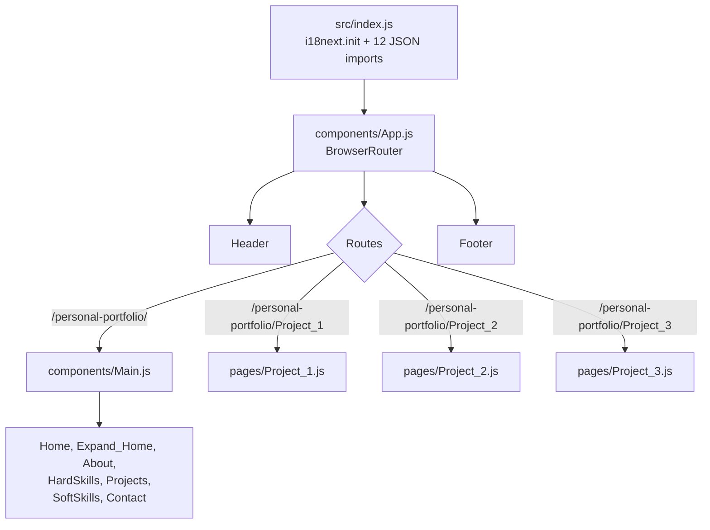

# Technical Audit — Current Portfolio

**Audit date:** August 2026
**Branch audited:** `main` @ `6863fa8`
**Live site audited:** `https://ericmartinezillamola.github.io/personal-portfolio/` (`gh-pages` @ `78709f6`)

All findings labelled **FACT** were observed directly in the repository, in git
history, or over HTTP against the live site. Nothing was built, installed or
modified to produce this audit.

---

## 0. Executive summary

**ASSESSMENT.** This is a competent 2023 bootcamp-era React application that was
built by hand, without a template, by someone learning the platform. Judged
against what it was trying to be at the time, it largely succeeded. Judged as a
2026 professional shopfront, it has four production defects that are visible to
any visitor, one bug that almost certainly prevents it building on Linux, and a
build toolchain the React team formally sunset in February 2025.

The important distinction: **almost none of these problems are the reason to
rebuild.** They are individually fixable in a day or two. The reason to rebuild
is architectural — there is no content model, so every piece of content is
welded into JSX — and that is covered in
[v2-architecture-options.md](v2-architecture-options.md).

---

## 1. Repository layout

**FACT.** The repository root contains almost nothing. The entire application
lives one level down in `proyecto-frontend/`.

```
personal-portfolio/
├── LICENSE                  MIT
├── README.md                1 byte (empty)
├── package.json             stray: 2 dependencies, no name, no scripts
├── package-lock.json        stray: 17 KB
└── proyecto-frontend/       <- the actual application
    ├── package.json
    ├── README.md            untouched Create React App boilerplate
    ├── public/              4 files
    └── src/                 15 JS files, 2 CSS files, 12 JSON files, 87 images
```

**FACT.** The root `package.json` and `package-lock.json` were added in commit
`ffc7cf6` ("gh pages", 2023-08-06). The `package.json` declares only
`gh-pages` and `react-hook-form`, has no `name`, no `version` and no `scripts`.

**ASSESSMENT.** These two root files are an accident — the residue of running
`npm install` in the wrong directory while setting up GitHub Pages deployment.
They are inert but confusing: a newcomer cloning the repo sees a `package.json`
at the root and reasonably assumes that is the project.

**ASSESSMENT.** The directory name `proyecto-frontend` ("frontend project") and
the matching `"name": "proyecto-frontend"` in its `package.json` are leftovers
from the Fundació Esplai bootcamp exercise this grew out of. The git history
confirms the origin: the repository was initially called `CV` (see the merge
commit `4580ca8`, which references `github.com/EricMartinezIllamola/CV`) and an
even earlier bootcamp repo name appears in `cbb5a14`
(`emi-fe-proyectoFrontend-16-07-2023`). It reads as unfinished — a personal
project that never got its own identity.

**FACT.** The root `README.md` is one byte. The `proyecto-frontend/README.md` is
the unmodified 71-line Create React App template, explaining `npm run eject` to
an audience of nobody.

**ASSESSMENT.** For a public repository linked from a CV, the README is the
first thing a curious engineer opens. Right now it says nothing about the
project at all.

---

## 2. Stack

### 2.1 Inventory

**FACT.** From `proyecto-frontend/package.json`:

| Concern | Choice | Version | Status in 2026 |
|---|---|---|---|
| UI library | `react` / `react-dom` | 18.2.0 | Two majors behind (19 shipped Dec 2024) |
| Language | JavaScript | — | No TypeScript, no JSDoc types |
| Build tool | `react-scripts` (Create React App) | 5.0.1 | **Deprecated.** No meaningful release since 2022 |
| Routing | `react-router-dom` | 6.14.2 | Behind (v7 current) |
| Hash scrolling | `react-router-hash-link` | 2.4.3 | Niche, low maintenance |
| i18n | `i18next` / `react-i18next` | 23.4.1 / 13.0.2 | Behind but healthy library |
| Forms | `react-hook-form` | 7.45.2 | Behind but healthy |
| Validation | `yup` + `@hookform/resolvers` | 1.2.0 / 3.1.1 | Behind but healthy |
| Email | `@emailjs/browser` | 3.11.0 | Third-party SaaS dependency |
| Deployment | `gh-pages` | 5.0.0 | Manual CLI push |
| Metrics | `web-vitals` | 2.1.4 | Collected but never reported anywhere |
| Testing | `@testing-library/*`, Jest via CRA | — | One boilerplate test that cannot run |

**FACT.** Two further dependencies are loaded from CDNs in
[`public/index.html`](../proyecto-frontend/public/index.html) rather than
through npm:

- Bootstrap 5.3.0 — both the CSS and the JS bundle, with SRI hashes.
- jQuery 3.7.0 (slim) — with an SRI hash.

**FACT.** jQuery is never used. There is no `$` or `jQuery` reference anywhere in
`src/`.

**ASSESSMENT.** The jQuery tag is a fossil from the pre-React version of this
site (see §7). It costs every visitor a DNS lookup, a TLS handshake and a
download for nothing.

### 2.2 Create React App is dead

**FACT.** The React team formally deprecated Create React App on 14 February
2025 ([official announcement](https://react.dev/blog/2025/02/14/sunsetting-create-react-app)),
stating that it "currently has no active maintainers" and directing existing
apps to migrate to a framework or to a build tool such as Vite, Parcel or
Rsbuild.

**ASSESSMENT.** This is the single clearest "this must change" item in the
stack, and it is not a matter of taste. An unmaintained build tool means
security advisories in the dependency tree are never patched, and it means the
project is anchored to Webpack 4-era build times and defaults. It does not mean
the site is dangerous to *visit* — this is a static site with no server and no
user data — but it does mean the toolchain is a dead end.

**ASSESSMENT.** Worth being fair about the original decision: in July 2023, CRA
was still the default answer for a beginner starting a React app, and Vite's
dominance was not yet obvious to someone outside frontend. This was a reasonable
choice that the ecosystem subsequently invalidated. That is not a mistake.

---

## 3. Architecture

### 3.1 Shape



**FACT.** 15 JavaScript files totalling 1,294 lines; 2 CSS files totalling 1,084
lines; 12 translation JSON files totalling 925 lines.

**FACT.** `src/components/` holds 11 files. Seven of them (`Home`,
`Expand_Home`, `About`, `HardSkills`, `Projects`, `SoftSkills`, `Contact`) are
not components in the reusable sense — they are one-off page sections, each
rendered exactly once, from `Main.js`.

**FACT.** `src/pages/` holds three near-identical files of 230, 231 and 220
lines.

**ASSESSMENT.** The `components/` vs `pages/` split is conventional and the
routing is clean. For a site with one page and three articles, this structure is
proportionate. The architecture is *coherent* — it is not spaghetti, and it does
what it says.

### 3.2 The real architectural problem: no content model

**FACT.** There is no data layer. Content exists in exactly two places: as
i18next keys in JSON files, and as hardcoded structure in JSX.

**FACT.** [`Projects.js`](../proyecto-frontend/src/components/Projects.js)
repeats the same 11-line card block six times, differing only in the link
target, a CSS class name and the translation key index:

```jsx
<div className='col'>
    <Link to="/personal-portfolio/Project_1#Project_1">
        <div className="project_card">
            <div className="project_img project_img_1"></div>
            <div className="project_content">
                <h2>{t("projects.t1")}</h2>
                <p>{t("projects.p1")}</p>
            </div>
        </div>
    </Link>
</div>
```

**FACT.** The project thumbnail images are not passed as props or data — they
are hardcoded as six separate CSS classes (`.project_img_1` through
`.project_img_6`) with `background-image` rules in
[`index.css`](../proyecto-frontend/src/styles/index.css) lines 627–650.

**ASSESSMENT.** This is the finding that matters most. **Adding a seventh
project requires editing three files** — a new JSX block in `Projects.js`, a new
CSS class in `index.css`, and new keys in three translation files — plus a new
route and a new 200-line page component if it needs a detail page. There is no
`projects.json`, no array, no `.map()`. Content and presentation are fused.

**ASSESSMENT.** This is the concrete, mechanical reason the portfolio stopped
being updated in December 2023. Publishing a paragraph costs a code change. That
friction compounds: it is also why five of the nine project translation files
were never translated (§4.2), and why the three placeholder images for planned
projects were eventually deleted rather than filled in (§7).

### 3.3 State management

**FACT.** There is no state management library and none is needed. All state is
local `useState`: `open_menu` in `Header`, `open_perfil_card` and
`open_perfil_card_2` in `About`, and four `*_up` label-position booleans in
`Contact`. The only shared context is `I18nextProvider`.

**ASSESSMENT.** Correct call. A portfolio does not need Redux. This is an
example of the project *not* over-engineering, which is worth crediting.

### 3.4 Code-level defects

**FACT.** `React.StrictMode` is nested three deep — `index.js:50`, `App.js:14`,
and `Main.js:12`.

**FACT.** [`App.js`](../proyecto-frontend/src/components/App.js) imports
`ReactDOM` on line 2 and never uses it.

**FACT.** Route paths are hardcoded with the `/personal-portfolio/` prefix in
seven places across `App.js`, `Header.js`, `Home.js` and `Projects.js`, rather
than using React Router's `basename`.

**ASSESSMENT.** This hardcoding is why the site is welded to its GitHub Pages
subpath. Moving to a custom domain today would mean a find-and-replace across
four files.

**FACT.** `cv_download()` is duplicated verbatim — identical 10-line body — in
[`About.js`](../proyecto-frontend/src/components/About.js) lines 10–20 and
[`Footer.js`](../proyecto-frontend/src/components/Footer.js) lines 7–17.

**FACT.** Both copies download the CV by `fetch`-ing it into a blob and
synthesising an `<a>` element. The file is a static asset in `public/`; a plain
`<a href="..." download>` would do the same thing with no JavaScript.

**FACT.** The CV file is named `CV_Èric Martínez.pdf` — containing both a space
and a non-ASCII character — and is fetched with a relative path
(`fetch('CV_Èric Martínez.pdf')`). On a URL without a trailing slash this
resolves to the wrong directory.

**FACT.** In [`Contact.js`](../proyecto-frontend/src/components/Contact.js) line
71, the textarea handler is `onInput={() => { auto_grow(this) }}`. In a
module-scope arrow function `this` is `undefined`; `auto_grow` also ignores its
parameter entirely and re-queries the DOM with `document.getElementById`.

**FACT.** `Contact.js` `sendEmail()` reports success and failure only via
`console.log`. The user receives no confirmation, no error message and no
loading state — the form simply resets.

**ASSESSMENT.** For the site's only conversion point, silent submission is the
most damaging UX defect in the application. A visitor cannot tell whether their
message was sent.

**FACT.** EmailJS identifiers are hardcoded in source: service `service_fbbp8js`,
template `template_ivpe2dr`, public key `arVXXxhjsKGel8GZf`.

**ASSESSMENT.** The EmailJS public key is designed to be public, so this is not
a credential leak. It is, however, an unprotected form endpoint with no CAPTCHA,
no rate limiting and no honeypot, published on a public site for two and a half
years.

---

## 4. Internationalisation

### 4.1 How it works

**FACT.** Three locales (`ca`, `es`, `en`) × four namespaces (`index`,
`project_1`, `project_2`, `project_3`) = 12 JSON files under
`src/translations/`.

**FACT.** All 12 are statically imported at the top of
[`index.js`](../proyecto-frontend/src/index.js) and passed to `i18next.init()`
as an inline `resources` object. There is no lazy loading and no HTTP backend.

**FACT.** The active language is read from `localStorage.getItem("lng")`,
defaulting to `"es"`. `Header.js` writes it back on change.

**FACT.** Key parity across locales is perfect. Flattened key counts are
identical for every namespace: 75 keys in `index`, 46 in `project_1`, 49 in
`project_2`, 48 in `project_3`. A programmatic diff of the `es`, `ca` and `en`
key sets for `index` returns no differences.

**ASSESSMENT.** The *structure* here is genuinely good, and better than most
portfolios attempt. Namespacing by page means a project page only ever loads its
own strings. Perfect key parity means nothing renders as a raw key. Somebody
took this seriously.

### 4.2 Where it broke down

**FACT.** Five of the nine project translation files contain Spanish text
regardless of the locale they claim to serve. Verified by inspecting content, not
filenames:

| Namespace | `es` | `ca` | `en` |
|---|---|---|---|
| `index` | Spanish (correct) | Catalan (correct) | English (correct) |
| `project_1` | Spanish (correct) | Catalan (correct) | **Spanish** |
| `project_2` | Spanish (correct) | **Spanish** | **Spanish** |
| `project_3` | Spanish (correct) | **Spanish** | **Spanish** |

For example, `en/project_1.json` opens with `"Machine Learning (ML) se considera
una subcategoría de la Inteligencia Artificial (AI)..."` — the Spanish source
text, byte-identical to `es/project_1.json`.

**ASSESSMENT.** The homepage is fully trilingual; the project pages are
effectively Spanish-only. A visitor who selects English gets an English shell
and Spanish articles. This is worse than not offering the language, because it
sets an expectation and then breaks it mid-page.

**FACT.** Git history shows translation was done piecemeal, one namespace-locale
pair per commit — `1458c01 i18next_index_es`, `4939651 index_cat_en`,
`abc533a img + proj_1_es`, `37e2667 project_1_ca`, `cf4695f project_2_es`,
`321a043 project_3_es` — and simply stopped.

**ASSESSMENT.** Nothing in the system made the gap visible. Because the
untranslated files are complete Spanish *copies* with correct keys, every
automated signal says they are fine: no missing keys, no fallback warnings, no
build error. The only way to detect the problem is to read them. **The
architecture guaranteed this failure would be silent.**

### 4.3 Dead and mistranslated content

**FACT.** Each locale defines 11 `contact.error.*` keys (e.g.
`"Nombre, campo obligatorio"`). None are referenced anywhere in the codebase.
`Contact.js` renders `{errors.nombre?.message}`, which is Yup's default English
string.

**ASSESSMENT.** 33 hand-written translation strings are dead, and every user in
every language sees validation errors in English — "Name is a required field" —
even on the Catalan site.

**FACT.** `footer: {}` is an empty object in all three `index.json` files. The
`Footer` component reads from the `home` and `about` namespaces instead.

**FACT.** Copy errors present in the source:

- `en/index.json` — `"Lenguage"` (should be "Language"), `"Business
  Inteligence"`, `"Data Managment"`, `"Artificial Inteligence"`.
- `es/index.json` — `"2nd Semestre"` (English ordinal in Spanish text),
  `"daily metting"`, `"tecnologias"` (missing accent).
- `ca/index.json` — `"2nd Semestre"` (same, in Catalan text).

**FACT.** The three locales disagree on content, not just wording. English:
`"Data, cheese and dogs lover."` Spanish: `"Apasionado de los datos y amante del
queso."` Catalan: `"Apassionat de les dades i amant del formatge."` The dogs
appear only in English.

### 4.4 Structural i18n gaps

**FACT.** `<html lang="es">` is hardcoded in `public/index.html` and never
updated when the language changes. A screen reader will pronounce English and
Catalan content with Spanish phonetics.

**FACT.** Language is not represented in the URL. There is no `/en/`, `/es/` or
`/ca/` path and no `?lang=` parameter — it lives only in `localStorage`.

**ASSESSMENT.** Two consequences. First, a language choice cannot be shared:
sending someone the English site is impossible. Second, and more seriously for a
site whose purpose is discoverability, **search engines can only ever index one
language.** There is one URL, so there is one document, so two thirds of the
translation work is invisible to Google. There are also no `hreflang`
annotations, which is the mechanism that would tell a crawler these variants
exist.

**ASSESSMENT.** Given the stated intention to keep all three languages in v2,
this is the single most important i18n change to make: locale must move into the
URL.

---

## 5. Styling and UI

### 5.1 Architecture

**FACT.** Two hand-written stylesheets, globally scoped, imported once in
`index.js`: `index.css` (998 lines) and `project_A.css` (86 lines). No CSS
Modules, no preprocessor, no utility framework, no CSS-in-JS.

**FACT.** `index.css` opens with a hand-maintained table of contents comment
listing its nine sections, and defines nine design tokens in `:root`
(`--white`, `--black`, `--no_black`, `--no_black_05`, `--no_black_08`,
`--orange`, `--orange_2`, `--red`, `--green`).

**ASSESSMENT.** Design tokens plus a documented section index in 2023, written by
hand with no framework, is a genuinely good instinct. This is one of the parts of
the project worth being pleased about.

**FACT.** The identical nine-token `:root` block is duplicated verbatim at the
top of `project_A.css`.

**FACT.** Class naming is inconsistent — `snake_case` for custom classes
(`intro_box`, `perfil_card`, `card_backside`), Bootstrap's `kebab-case` for grid
classes (`col-12`, `col-sm`, `container-fluid`), and a positional single-letter
convention for images (`img_A`, `img_B1`, `img_C2`, `img_E5`, `img_P1_14`).

**ASSESSMENT.** `img_P1_14` means "the fourteenth image on project page 1". That
is a positional name, not a semantic one — reordering the page invalidates it.
There are 56 such classes.

**FACT.** Class names mix Spanish and English throughout: `perfil_card`,
`iconos_box`, `foto_perfil`, `idioma`, `mostrar_menu`, `btn_menu`, `intro_box`.

### 5.2 Layout system

**FACT.** Layout is Bootstrap's 12-column grid (`row` / `col-12 col-sm`) for
`HardSkills`, `Projects` and `Footer`, and Flexbox for everything else.

**FACT.** `HardSkills` pads its rows with empty spacer divs to force alignment —
`<div className="col img"></div>` appears 15 times across the five skill rows.

**FACT.** Core interactive elements have fixed pixel dimensions:
`.total_card` and `.perfil_card` are `350px × 400px`; `.project_card` is
`300px × 200px`; `#form_box` is `400px × 450px`.

**FACT.** Text inside the profile card is absolutely positioned at fixed offsets
— `.ul_perfil_1 { top: 70px; left: 120px; }`, `.ul_perfil_2 { top: 250px; }`.

**ASSESSMENT.** A fixed-height card containing translated text is fragile by
construction. German or a longer Catalan phrasing would overflow a 400px box
with no reflow. The layout only holds because the current strings happen to fit.

**FACT.** `section { width: 100%; height: 100vh; overflow: hidden; }` is a global
rule.

**ASSESSMENT.** Two problems. `100vh` on mobile browsers does not account for
the dynamic address bar, so full-height sections are clipped or jump on scroll —
this is the classic 2023 mobile viewport bug, since solved by `100dvh`. And a
global `overflow: hidden` on every section means any content that does exceed
its box is silently cut off rather than scrolled.

### 5.3 Responsiveness

**FACT.** Two breakpoints in `index.css`: `max-width: 720px` and
`max-width: 576px`. One in `project_A.css`: `max-width: 720px`.

**FACT.** At ≤720px the desktop nav is replaced by a hamburger toggling a
`.mostrar_menu` class on a full-height overlay.

**FACT.** Dropdown menus open purely on CSS hover — `li:hover ul { display:
block; }` — including inside the mobile breakpoint, where the rule becomes
`.dropdown:hover ul { display: block; }`. There is no click or focus handler on
either the Projects dropdown or the language dropdown.

**ASSESSMENT.** This is a functional bug on touch devices, not merely an
accessibility one. Hover is emulated unreliably on touchscreens; on many mobile
browsers the first tap fires the parent link's navigation instead of revealing
the submenu. **On a phone, the language switcher and the projects submenu are
difficult or impossible to open.** The language switcher is the only way to
change language, since language is not in the URL.

### 5.4 Typography

**FACT.** `* { font-family: Garamond; }` — a universal selector setting the font
for every element, with no fallback stack and no generic family.

**FACT.** Roboto is imported from Google Fonts on line 1 of `index.css` but
applied to only two rules: `.intro` and `.intro_a`.

**ASSESSMENT.** Garamond is not a web-safe font. It is present on most macOS and
many Windows installs, absent on most Linux and most Android devices. With no
fallback declared, those visitors get the browser default — so the site's
typography is materially different depending on the operating system, and there
is no `@font-face` to make it deterministic. Meanwhile a webfont *is* being
downloaded, and is used for two headings.

**FACT.** Type sizes are set in `px` throughout (`font-size: 16px`, `20px`,
`11px`, `35px`). The hero subtitle `#intro_2` is `11px` with `letter-spacing:
3px`.

**ASSESSMENT.** Fixed `px` sizing ignores a user's browser font-size preference.
11px uppercase with wide letter-spacing is below comfortable reading size.

### 5.5 Animation

**FACT.** Transitions are used consistently and with intent: a 700ms scale-in
underline on nav hover, a 1000ms `rotateY(-180deg)` card flip in `About`, a
500ms scale-and-reveal on project cards, a 500ms floating-label transition on
form inputs.

**FACT.** `.btn_start::before` runs `animation: rotate 2000ms linear infinite` —
a permanently spinning conic gradient on the hero.

**FACT.** There is no `@media (prefers-reduced-motion: reduce)` block anywhere.

**ASSESSMENT.** The animation work is the most accomplished part of the CSS, and
the card flip in particular is a nice piece of hand-written 3D transform work.
But an infinite animation with no reduced-motion escape hatch is both an
accessibility problem for motion-sensitive users and a permanent, small drain on
battery and compositor time.

### 5.6 Visual consistency

**ASSESSMENT.** The palette is disciplined — near-black `#16151C`, white, and
two oranges — and applied consistently across sections. Section rhythm
(`padding-top: 11vh`) is uniform. For a hand-rolled design this holds together
better than the code quality would suggest.

**ASSESSMENT.** Where it reads as dated is the decoration: dashed orange borders
on project cards, `border-style: inset` on the profile card, a `scale(1.25)`
hover that lifts cards over their neighbours, and a full-bleed sunset photograph
behind the contact form. These are 2023 CodePen idioms. They are not *bad*, but
they signal "portfolio exercise" rather than "professional practitioner", which
is exactly the gap the 2026 version needs to close.

---

## 6. Performance

### 6.1 Images — the dominant problem

**FACT.** `src/` contains 87 raster images totalling **13.20 MB**. The deployed
`static/media/` directory contains 64 files totalling **12.99 MB**.

**FACT.** A single file accounts for three quarters of that. Verified live:

```
GET /personal-portfolio/static/media/rstudio.0689d33971de2d55c378.png
→ 200, 10,153,873 bytes, image/png
```

**FACT.** That image is the RStudio logo, rendered by
[`HardSkills.js`](../proyecto-frontend/src/components/HardSkills.js) inside a
grid capped at `max-height: 50px`.

**ASSESSMENT.** A 9.7 MB PNG is being downloaded to display a logo at 50 pixels
tall. On a typical 4G connection this is roughly ten seconds of transfer for one
decorative image. It is comfortably the highest-impact single fix in the
repository, and it needs no rebuild — a resized PNG would be about 8 KB, a
reduction of over 99.9%.

**FACT.** The next largest assets, all also oversized for their display size:

| File | Size | Displayed at |
|---|---|---|
| `rstudio.png` | 9,915.9 KB | 50px tall |
| `foto_perfil.jpg` | 749.8 KB | 98 × 140 px |
| `css3.png` | 316.5 KB | 67px tall |
| `sunset.jpg` | 259.6 KB | background |
| `jquery.png` | 252.4 KB | 67px tall |
| `mongodb.png` | 225.2 KB | 75px tall |
| `python.png` | 183.9 KB | 50px tall |
| `apachehadoop.png` | 165.1 KB | 100px tall |
| `mysql.png` | 147.8 KB | 75px tall |

**FACT.** Format distribution: 84 PNG (33 with `.PNG` extension, 51 with
`.png`), 2 JPEG, 1 WebP. No AVIF. The single `.webp` is `machinelearning.webp`.

**FACT.** No `` in the codebase has `width`, `height`, `loading`,
`decoding`, `srcset` or `sizes` attributes. There are no `<picture>` elements.

**ASSESSMENT.** Missing intrinsic dimensions cause cumulative layout shift as
images arrive. Missing `loading="lazy"` means all 21 images on a project page
load immediately, including those far below the fold.

### 6.2 Bundle

**FACT.** Measured against the live deployment:

- `static/js/main.2828c41c.js` — **777,287 bytes** uncompressed
- `static/css/main.9afcdd9f.css` — 26,150 bytes uncompressed

**FACT.** There is no route-based code splitting. No `React.lazy`, no dynamic
`import()`. The single `main.js` serves all four routes.

**FACT.** All 12 translation JSON files are statically imported into `index.js`
and therefore inlined into that bundle — including the full text of all three
project articles in all three languages, which contain substantial embedded R
source code (`a1.c` through `a11.c` in each project namespace).

**ASSESSMENT.** A visitor landing on the homepage downloads: three complete
project articles they may never open, in three languages of which they read one,
plus the R code samples inside them. Namespacing translations by page was the
right design — but because nothing is lazily loaded, the benefit is never
realised. Roughly two thirds of the translation payload is guaranteed waste on
every visit.

### 6.3 Third-party and network

**FACT.** `public/index.html` loads render-blocking resources from three
external origins before the app boots: `cdn.jsdelivr.net` (Bootstrap CSS and JS),
`fonts.googleapis.com` (Material Symbols), and `code.jquery.com` (jQuery). A
fourth Google Fonts request for Roboto is issued from the `@import` on line 1 of
`index.css`.

**ASSESSMENT.** Four extra origins, each needing DNS resolution, TCP connection
and TLS negotiation, for one unused library, one icon font, one grid system used
in three components, and one webfont used on two headings. There are no
`preconnect` hints.

**FACT.** A CSS `@import` at the top of `index.css` is the slowest way to load a
font — the browser cannot discover it until the stylesheet has been downloaded
and parsed.

### 6.4 Dead weight committed to the repository

**FACT.** Files present in `src/` but never referenced by any JS or CSS:

| File | Size | Note |
|---|---|---|
| `img/pentaho.png` | 49.6 KB | Orphaned by the case-sensitivity bug — see §9 |
| `img/javascript.png` | 43.6 KB | Superseded by `javascript2.png` |
| `img/django.png` | 5.5 KB | Never used |
| `logo.svg` | 2.6 KB | CRA boilerplate |
| `js/temp` | 0.4 KB | Four commented-out lines of scratch code |
| `js/index.js` | 3.7 KB | Pre-React vanilla JS — see §9 |

**FACT.** No unnecessary runtime dependencies were found in `package.json`
beyond `web-vitals`, which is imported and invoked with no callback
(`reportWebVitals()` on line 60 of `index.js`), so it measures performance and
discards the result.

### 6.5 Rendering

**ASSESSMENT.** No unnecessary re-render patterns were found. There are no
inline object or array literals passed as props, no context churn, no
`useEffect` misuse — largely because there is so little interactivity. The
triple-nested `StrictMode` (§3.4) causes triple-invocation of render in
development only, which is noisy but has no production effect.

---

## 7. SEO and discoverability

**FACT.** The complete `<head>` of the deployed page, in full:

```html
<html lang="es"><head>
<meta charset="UTF-8">
<meta name="viewport" content="width=device-width,initial-scale=1">
<title>Èric Martínez - Junior Data Scientist</title>
<link rel="icon" href="./favicon-32x32.png">
<!-- Bootstrap CSS, Material Symbols, ../src/styles/index.css -->
<!-- jQuery, Bootstrap JS, ../src/js/index.js -->
<script defer src="/personal-portfolio/static/js/main.2828c41c.js"></script>
<link href="/personal-portfolio/static/css/main.9afcdd9f.css" rel="stylesheet">
</head>
```

**FACT.** What is absent: `<meta name="description">`, all Open Graph tags
(`og:title`, `og:description`, `og:image`, `og:url`, `og:type`), all Twitter
Card tags, `<link rel="canonical">`, any `hreflang` annotation, and any
JSON-LD / structured data.

**ASSESSMENT.** With no `og:image` or `og:description`, sharing the portfolio
link on LinkedIn — the single most likely place it will be shared — produces a
bare, unstyled preview with no image and no summary. For a site whose job is to
make a first impression, this is a significant unforced loss.

**FACT.** The `<title>` is static and identical for all four routes. React never
updates it; there is no `react-helmet` or equivalent. Every page of the site is
titled "Èric Martínez - Junior Data Scientist".

**ASSESSMENT.** The title is also the site's loudest positioning statement, and
it says "Junior". See [content-audit.md](content-audit.md).

**FACT.** The application is a client-rendered SPA with no prerendering. The
served HTML body is `<div id="root"></div>`.

**ASSESSMENT.** Modern Googlebot does execute JavaScript, so the homepage is
indexable in principle. But it is a second-pass, deferred render, and other
crawlers — LinkedIn's preview bot, Bing, most AI crawlers — do far less. The
practical effect is that the content is much less discoverable than a static
site would be, for no benefit.

**FACT.** `public/robots.txt` is the CRA default: `User-agent: * / Disallow:`
(allow everything). There is no `sitemap.xml` and no `Sitemap:` directive.

**FACT.** `public/manifest.json` is unmodified CRA boilerplate. Its
`short_name` is `"React App"` and its `name` is `"Create React App Sample"`. It
references three icons — `favicon.ico`, `logo192.png` and `logo512.png` — all
three of which were deleted from `public/` in commit `cf4695f`. Verified live:
all three return 404.

**ASSESSMENT.** If the site is added to a phone home screen it is labelled
"React App".

**FACT.** The only favicon present is `favicon-32x32.png`. There is no
`apple-touch-icon`, no SVG icon and no 192/512px PWA icon.

### GitHub Pages implications

**FACT.** Deployment is manual: `npm run deploy` runs `gh-pages -d build` from a
developer machine. There is no GitHub Actions workflow — the repository contains
no `.github/` directory.

**ASSESSMENT.** Combined with the build bug in §9, this means the site can only
be deployed from the specific machine where the build happens to succeed. There
is no reproducible build.

**FACT.** The site is served from a subpath, `/personal-portfolio/`, not a domain
root.

---

## 8. Accessibility

Assessed by inspection against WCAG 2.1 AA. Not verified with a screen reader or
automated tooling.

### 8.1 Images

**FACT.** Alt text coverage across all 82 `` elements:

| Location | Count | Alt attribute |
|---|---|---|
| `pages/Project_1.js` | 15 | **None** — attribute absent entirely |
| `pages/Project_2.js` | 20 | **None** |
| `pages/Project_3.js` | 21 | **None** |
| `components/HardSkills.js` | 25 | `alt=''` (empty) |
| `components/About.js` | 1 | `alt=''` (empty) |

**ASSESSMENT.** Not a single image on the site has meaningful alternative text.

The two failures are different in kind. The 56 project-page images have **no
`alt` attribute at all**, which is a straightforward WCAG 1.1.1 failure — a
screen reader announces the filename or "image". These images are charts,
confusion matrices, word clouds and console output: they carry the entire
analytical result of each article.

The 26 `alt=''` cases assert the image is decorative. For the profile photo that
is arguable. For the 25 skill logos it is wrong: those logos **are** the content
of the Hard Skills section. There is no text alternative anywhere — the markup
is a category label followed by bare images. A screen reader user hears "Data
Mining:" and then silence. **The entire skills section is invisible to
assistive technology.**

### 8.2 Keyboard navigation

**FACT.** Both dropdown menus — Projects and Language — are revealed by
`li:hover ul { display: block; }` with no `:focus-within`, no click handler and
no `aria-expanded`.

**ASSESSMENT.** A keyboard user tabbing through the header cannot open either
dropdown. The submenu links are in the DOM and focusable, so focus moves into an
invisible menu. **The language switcher is unreachable by keyboard**, and since
language is stored only in `localStorage` and never in the URL, a keyboard-only
user has no way at all to change the site's language.

**FACT.** `.input_box input:focus, #mensaje:focus { outline: none; }` removes the
browser focus ring from all four form fields, replacing it only with a
`border-color` change from white to orange.

**FACT.** There is no `:focus-visible` rule anywhere in either stylesheet.

**ASSESSMENT.** Outside the form fields, focus indication relies entirely on the
browser default, which the `::before`/`::after` hover decorations on nav links
partially obscure.

**FACT.** There is no skip link.

### 8.3 Semantics and ARIA

**FACT.** Landmark structure is correct: one `<header>`, one `<main>`, one
`<footer>`, and content grouped in `<section>` elements.

**FACT.** Heading hierarchy is not. Every section uses `<h1>` — `Home`,
`HardSkills`, `Projects`, `SoftSkills` and `Contact` each render an `<h1>`, and
each project page renders another. The homepage has five `<h1>` elements.

**FACT.** `Home.js` renders `<h1>` immediately followed by `<h3>`, skipping
`<h2>`.

**FACT.** `class="` is used instead of `className=` in **176 places** —
`SoftSkills.js` (11), `Project_1.js` (63), `Project_2.js` (54), `Project_3.js`
(48).

**FACT.** `for="` is used instead of `htmlFor=` on all four `<label>` elements in
`Contact.js`.

**ASSESSMENT.** React renders `class` and `for` with a console warning rather
than dropping them, so the styling works. But `for=` is the mechanism that binds
a label to its input; whether React forwards it correctly is a detail no one
should be relying on. The safe reading is that **form labels are not reliably
associated with their fields**, which breaks both screen reader announcement and
click-to-focus.

**FACT.** `Project_1.js` declares duplicate DOM ids: `accordionPanelsStayOpen_6`
appears twice (lines 167 and 190) and `panelsStayOpen-collapseOne_6` appears
twice (lines 174 and 197).

**ASSESSMENT.** Duplicate ids are invalid HTML, and here they are functional
too: Bootstrap's accordion targets panels by id selector, so the two colliding
accordions on that page will toggle the wrong panel.

**FACT.** `Project_2.js` and `Project_3.js` each contain 38 instances of a `<p>`
nested inside a `<button>` nested inside a `<p class="accordion-header">`.

**ASSESSMENT.** `<p>` cannot contain block or interactive content. Browsers will
auto-close the outer paragraph, producing a DOM that does not match the JSX and
triggering React `validateDOMNesting` warnings.

**FACT.** The mobile menu button has no `aria-expanded`, no `aria-controls` and
no accessible name — its content is a Material Symbols ligature (`Menu` /
`Close`) inside a `<span>`.

**FACT.** Language buttons have no `aria-current`, no `lang` attribute and no
indication of which language is active.

**FACT.** Correctly done: both social links carry `aria-label` ("LinkedIn
Profile", "GitHub Profile"), which matters because they are empty `<a>` elements
styled with `background-image`. Both also carry `rel="noopener noreferrer"`.

### 8.4 Colour contrast

**FACT.** `section h1 { color: var(--orange); }` where `--orange: orange`
(`#FFA500`). On the white background of `#HardSkills`, this is a contrast ratio
of approximately **2:1**.

**ASSESSMENT.** WCAG AA requires 4.5:1 for body text and 3:1 for large text. The
"Hard Skills" heading fails even the large-text threshold. The same orange on
the dark `#16151C` background elsewhere passes comfortably — the problem is
specific to orange-on-white.

**FACT.** `--red: red` on the translucent dark form background is roughly 5:1
and passes.

### 8.5 Forms and motion

**FACT.** Validation errors render into `<p className='error'>` with no
`role="alert"`, no `aria-live`, no `aria-invalid` on the field and no
`aria-describedby` linking error to input.

**FACT.** All four inputs are `type="text"` — including the email field, which
should be `type="email"` to trigger the correct mobile keyboard and native
validation.

**FACT.** Submission produces no visible feedback of any kind (§3.4).

**FACT.** No `prefers-reduced-motion` support, with one infinite animation
running (§5.5).

**FACT.** `::-webkit-scrollbar { width: 0px; }` hides scrollbars across the
entire site in Chromium and WebKit browsers.

**ASSESSMENT.** This removes the primary visual cue for page length and scroll
position, on pages that are extremely long (the project articles run to dozens
of screens). It also removes a direct manipulation affordance for users who
drag the scrollbar rather than scroll — which includes many users with motor
impairments.

---

## 9. Confirmed production defects

Everything in this section was verified, not inferred. HTTP checks were run
against the live site in August 2026.

### D1 — Deep links return 404 (severity: high)

**FACT.** `App.js` uses `BrowserRouter`, and the `gh-pages` branch contains no
`404.html`. GitHub Pages serves static files only and cannot rewrite unknown
paths to `index.html`.

```
GET /personal-portfolio/            → 200
GET /personal-portfolio/Project_1   → 404
```

**ASSESSMENT.** Only in-app clicks reach the project pages. A shared link is
broken, a refresh on a project page is broken, a bookmark is broken, and no
project page can ever be indexed by a search engine. The header dropdown
advertises three project pages that no external link can reach.

### D2 — Two resources 404 on every page load (severity: medium)

**FACT.** `public/index.html` contains `<link rel="stylesheet"
href="../src/styles/index.css">` and `<script src="../src/js/index.js">`. From
`/personal-portfolio/index.html` these resolve above the deployment root.

```
GET /src/styles/index.css → 404
GET /src/js/index.js      → 404
```

**ASSESSMENT.** Harmless in effect — the real stylesheet is injected by the
build, and the vanilla JS file is obsolete — but two guaranteed 404s on every
visit, visible in any devtools console or Lighthouse run.

### D3 — Web app manifest is broken boilerplate (severity: low)

**FACT.** As detailed in §7: `manifest.json` is named "Create React App Sample"
and all three referenced icons 404.

### D4 — Oversized hero-blocking image (severity: high)

**FACT.** As detailed in §6.1: a 9.7 MB PNG served for a 50px logo.

### D5 — Build fails on case-sensitive filesystems (severity: high)

**FACT.** `HardSkills.js` line 34 calls `require('../img/pentaho.PNG')`.
`git ls-files` reports the tracked filename as
`proyecto-frontend/src/img/pentaho.png` — lowercase. `core.ignorecase` is unset
in this clone.

**FACT.** Corroborating evidence from the `gh-pages` history: the built asset was
emitted as `static/media/pentaho.ef1aeeff28e9aea7e40e.PNG` — uppercase — meaning
the build that produced it ran on a case-insensitive filesystem which silently
resolved `.PNG` to the `.png` file.

**ASSESSMENT.** Webpack cannot resolve `pentaho.PNG` on Linux, so
`npm run build` will fail with "Module not found". The site builds on Windows
and macOS and not in any standard CI environment. This is the reason a GitHub
Actions deployment cannot simply be switched on, and it is a one-character fix.

### D6 — Two of six showcased projects are unreachable (severity: high)

**FACT.** Both Streamlit-hosted projects now redirect anonymous visitors into an
authentication loop, terminating after 50 redirects at
`/-/login?payload=...`:

```
GET https://ericmartinezillamola-llm-faqs.streamlit.app/  → 303 → auth loop
GET https://ericmartinezillamola-llm-sql.streamlit.app/   → 303 → auth loop
```

The nbviewer notebook (Rental Prices BCN) still returns 200.

**ASSESSMENT.** "Tesco FAQs" and "InnovaTech SQL" are the two most recent and
most professionally relevant projects on the site — the only ones touching LLMs.
Both are dead links for any visitor who is not logged into Streamlit. A recruiter
clicking either gets a login wall. Note this is an external platform change, not
a defect in this repository, but the effect on the portfolio is the same.

### D7 — Silent contact form (severity: medium)

**FACT.** As detailed in §3.4: submission results are logged to the console
only.

### D8 — The only test cannot run (severity: low)

**FACT.** `src/App.test.js` is unmodified CRA boilerplate asserting the presence
of a "learn react" link. It does `import App from './App'`, but `App.js` lives at
`src/components/App.js`. The import cannot resolve.

**ASSESSMENT.** `npm test` fails at module resolution. There is no test coverage
and never was; this is boilerplate that was never deleted.

---

## 10. Legacy and dead code

**FACT.** [`src/js/index.js`](../proyecto-frontend/src/js/index.js) is 117 lines
of pre-React vanilla JavaScript. Roughly a third is commented out (a `fetch` of
`assets/json/esp.json`, a dropdown toggle, an expand/collapse handler). The
remainder is manual form validation superseded by React Hook Form.

**FACT.** Its line 37 reads:

```js
let NombreError = EmailError = MotivoError = MensajeError = true;
```

**ASSESSMENT.** Only `NombreError` is declared. The other three become implicit
globals, which throws `ReferenceError` under strict mode — and ES modules are
always strict. The file is only spared because it is loaded via a `<script>` tag
that 404s (D2).

**FACT.** Three of its four validators contain a copy-paste bug:
`validarMotivo()`, `validarMensaje()` and `validarEmail()` were meant to set
their own flags, but `validarMotivo` and `validarMensaje` both set
`NombreError = false` instead.

**ASSESSMENT.** This file is dead in three independent ways — not imported by
any module, loaded only through a 404ing script tag, and superseded by the React
form. It should simply go.

**FACT.** `src/js/temp` contains four commented-out `register()` calls, working
notes from building the contact form.

**FACT.** `src/logo.svg` is the CRA spinning-atom logo, unreferenced.

**FACT.** `Expand_Home.js` is an 8-line component rendering a single empty
`<section className="expand_section" id="expand_home">`, styled to `height:
20vh`, used purely as a vertical spacer.

**FACT.** `reportWebVitals()` is called with no arguments, so measurements are
computed and discarded.

---

## 11. Git history and evolution

**FACT.** 46 commits, spanning 2023-07-16 to 2023-12-23. Nothing since — a gap
of two years and eight months at the time of audit.

**FACT.** The project began as static HTML/CSS/JS and was converted to React on
day two, in commit `aa7fb5c` ("transform into react", 2023-07-17).

**FACT.** Chronology of the significant architectural moves:

| Commit | Date | What changed |
|---|---|---|
| `6a456f4` | 2023-07-16 | Initial commit — vanilla HTML/CSS/JS |
| `aa7fb5c` | 2023-07-17 | Converted to React |
| `d56da88` | — | React Router introduced |
| `2ac3c29` | — | Bootstrap accordions; `project_1.css` merged into `project_A.css` |
| `8b89ca4` | — | i18next introduced |
| `1458c01` | — | `src/json/esp.json` deleted — the hand-rolled i18n it replaced |
| `a9be01c` | — | EmailJS wired up |
| `c9aa190` | — | Yup validation replaced the vanilla validators |
| `ffc7cf6` | 2023-08-06 | GitHub Pages setup — stray root `package.json` created here |
| `29ffd5e` | — | Route prefix changed from `/CV` to `/personal-portfolio` |
| `4a3e33c` | 2023-12-22 | Last content commit: LLM projects, CV, hard skills |
| `6863fa8` | 2023-12-23 | Final commit |

**FACT.** The repository was renamed. Merge commit `4580ca8` references
`github.com/EricMartinezIllamola/CV`, and `cbb5a14` references
`emi-fe-proyectoFrontend-16-07-2023`. Commit `29ffd5e` ("/CV") is the rename
fallout — the hardcoded route prefix being changed by hand across four files,
which is exactly the cost §3.4 describes.

**FACT.** Abandoned work visible in deleted files:

- `src/components/Expand_HardSkills.js` — a spacer component, deleted in
  `37e2667`.
- `src/img/placeholder_project1.png` and `src/img/placeholder_projectX.PNG` —
  deleted in `11fe714` and `4a3e33c`.
- `src/json/esp.json` — the pre-i18next translation approach.
- `src/styles/project_1.css` — consolidated into `project_A.css`.
- `src/img/pentaho2.PNG`, `bootstrap.png`, `mongodb2.png`, `mongodb3.png`,
  `powerbi2.png`, `Imagen_Perfil.jpg`, `lake.jpg`, `sunrise.jpg`,
  `country_silhouette.png` — superseded asset variants.

**ASSESSMENT.** The placeholder images are the most telling artefact. They show
slots were deliberately reserved for projects that were never added, and were
eventually deleted rather than filled. That is the friction described in §3.2,
recorded in the history.

**FACT.** `public/favicon.ico`, `logo192.png` and `logo512.png` were deleted in
`cf4695f` while `manifest.json` — which references all three — was left
untouched. This is the origin of D3.

**FACT.** Commit messages are terse and inconsistent: `xx`, `varis`, `accrdion`,
`href 2`, `btn start 2`, `no master`.

**FACT.** The author on most commits resolves to `unknown`; only the initial
commit and the README update carry `EricMartinezIllamola`. `user.name` and
`user.email` were evidently not configured on the machine used.

**ASSESSMENT.** For a public repository serving as a work sample, a contribution
graph where most commits are unattributed is a small but real loss. Worth fixing
the git config before v2 work begins — though rewriting the existing history is
not worth it.

**ASSESSMENT.** Read as a whole, the history tells a clear and rather positive
story: a bootcamp exercise that was iteratively and genuinely improved over six
months — vanilla to React, hand-rolled i18n to i18next, manual validation to
schema validation, single page to routed pages. Each step was a real upgrade.
The project did not decay; it stopped. And it stopped at precisely the point
where adding content had become more expensive than the content was worth.

---

## 12. What was done well

Stated plainly, because an audit that only lists faults is not an honest audit.

1. **It is entirely hand-built.** No template, no component library, no
   copy-pasted theme. The layout, the card flip, the nav transitions and the
   floating form labels were all written from scratch. That was the stated goal
   and it was met.
2. **Design tokens from the start.** Nine CSS custom properties in `:root`,
   used consistently. Many professional codebases of that era did worse.
3. **A real i18n architecture, not string swapping.** Namespaced by page, with
   perfect key parity across three locales. The design was sound; only the
   content discipline lapsed.
4. **Schema-driven validation.** Moving from hand-written regex validators to
   Yup with `@hookform/resolvers` was a deliberate upgrade, visible in the
   history, and it is the right pattern.
5. **Long-form technical writing.** Roughly 3,000 words explaining K-NN,
   K-means, TDM sparsity and confusion matrices — with worked arithmetic, not
   hand-waving. Choosing to *explain* rather than post screenshots was the right
   instinct and is rarer than it should be.
6. **Appropriate restraint on state.** No Redux, no premature abstraction, no
   architecture for its own sake.
7. **Steady, real iteration.** Six months of genuine improvement, each step
   moving toward better practice.

**ASSESSMENT.** The 2026 rebuild should be understood as replacing a
successfully completed learning project, not as repairing a failure.

---

## 13. Findings summary

Ordered by impact on the portfolio's actual purpose.

| # | Finding | Type | Severity |
|---|---|---|---|
| 1 | Positioning says "Junior Data Scientist"; no professional experience anywhere | Content | **Critical** |
| 2 | No content model — adding a project means editing 3+ files | Architecture | **Critical** |
| 3 | Deep links 404; project pages unreachable and unindexable (D1) | Defect | High |
| 4 | 5 of 9 project translation files are untranslated Spanish | Content/i18n | High |
| 5 | 9.7 MB PNG for a 50px logo; 13 MB of images total (D4) | Performance | High |
| 6 | Build fails on case-sensitive filesystems (D5) | Defect | High |
| 7 | Two of six showcased projects are dead links (D6) | Content | High |
| 8 | Zero meaningful alt text on 82 images; skills section invisible to AT | Accessibility | High |
| 9 | Dropdowns are hover-only — unusable by keyboard, unreliable on touch | Accessibility | High |
| 10 | No meta description, no Open Graph, no canonical, no hreflang | SEO | High |
| 11 | Create React App deprecated with no maintainers | Stack | Medium |
| 12 | Locale absent from URL — only one language is indexable or shareable | i18n | Medium |
| 13 | 777 KB JS bundle, no code splitting, all translations eagerly loaded | Performance | Medium |
| 14 | Contact form gives no feedback on success or failure (D7) | UX | Medium |
| 15 | `class`/`for` instead of `className`/`htmlFor` in 180 places | Correctness | Medium |
| 16 | Orange-on-white headings at ~2:1 contrast | Accessibility | Medium |
| 17 | Duplicate DOM ids break an accordion on Project_1 | Defect | Low |
| 18 | Dead code: `js/index.js`, `js/temp`, `logo.svg`, unused images | Hygiene | Low |
| 19 | Broken manifest, missing icons, stray root `package.json` (D3) | Hygiene | Low |
| 20 | Boilerplate READMEs; only test cannot run (D8) | Hygiene | Low |

**ASSESSMENT.** Items 3, 5, 6, 15, 17, 18 and 19 could all be fixed in a day
without touching the architecture. That they have not been fixed is not
laziness — it is that the site stopped being worth editing, for the reason in
item 2.

Items 1 and 2 are the ones that justify a rebuild. Everything else is symptom.

---

## HUMAN INPUT REQUIRED

Technical questions this audit could not answer from the repository:

1. **Is the EmailJS account still active?** The service and template ids are
   hardcoded and the form has been live for two and a half years. Do submissions
   still arrive? Has it received spam?
2. **Do you still have the source projects?** The R scripts behind Text Mining
   and the two Clustering articles, and the Streamlit app repositories. The
   portfolio contains only prose and screenshots.
3. **Can the Streamlit apps be revived?** They were built on Google PaLM, which
   has since been superseded by Gemini. If the underlying API is gone, these are
   not just login-walled but unrunnable. See D6.
4. **Is `EricMartinezIllamola.github.io/personal-portfolio` linked anywhere
   that matters?** LinkedIn profile, CV PDF, email signature, GitHub profile
   README. This determines how much the URL is worth preserving.
5. **Is the `CV_Èric Martínez.pdf` in `public/` current?** It was last committed
   in December 2023.
6. **Is there a reason `proyecto-frontend/` is nested one level down?** It is
   assumed to be bootcamp residue, but confirm before any restructuring.
