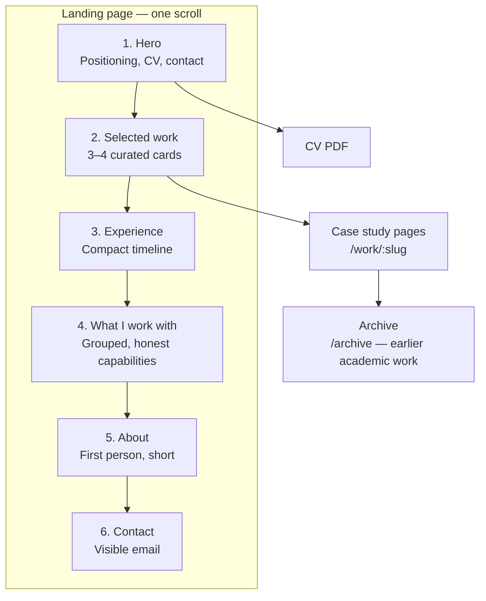

# v2 Information Architecture

**Status:** Proposal. Nothing implemented.

A proposed structure for the 2026 portfolio and the reasoning behind it. This
assumes the positioning work in [v2-vision.md](v2-vision.md) and is independent
of the stack choice in
[v2-architecture-options.md](v2-architecture-options.md) — the structure below
would work in any of them.

**A caution.** The brief suggested Introduction, About, Experience, Projects,
Skills, Contact as a starting point. That is the default portfolio structure and
it is a reasonable default. But it is worth noticing that the current site
already has essentially those sections and still fails, which means the section
*list* is not the problem. What follows keeps some of the defaults, changes
others, and tries to justify each rather than inherit it.

---

## 1. The design constraint

Three readers with incompatible needs, from [v2-vision.md](v2-vision.md) §3:
a recruiter with 30–60 seconds, a technical reader with 3–10 minutes, and a human
reader who wants to know if you are interesting.

**ASSESSMENT.** The failure mode is averaging — producing a site that is
moderately informative, moderately deep and moderately personal, which serves
nobody. The alternative is **layering**: each reader gets a complete experience
at their depth, and depth is optional rather than mandatory.

That is the organising principle for everything below.

---

## 2. Proposed structure



Six sections on one page, plus case study pages, plus an archive.

### Why this order

**ASSESSMENT.** The sequence answers a stranger's questions in the order they
actually arise:

1. *Who is this?* — Hero
2. *Are they any good?* — Selected work
3. *Is that real, or hobby projects?* — Experience
4. *Would they fit what I need?* — Capabilities
5. *Would I want to work with them?* — About
6. *How do I reach them?* — Contact

**ASSESSMENT.** The important departure from the current site is that **evidence
comes before credentials.** Right now the order is About (two degrees) → Hard
Skills (25 logos) → Projects. A visitor meets the qualifications before seeing
anything built. Reversing this is the structural expression of the shift from a
potential claim to an evidence claim.

**ASSESSMENT.** Putting work before experience is deliberate and slightly
unconventional. A recruiter wants the employment history; a technical reader
wants the work. The work section serves both — it is scannable enough for the
recruiter and deep enough to invite the engineer — whereas a timeline serves only
one. The timeline is immediately below, so nobody has to hunt for it.

---

## 3. Section by section

### 3.1 Hero

**Purpose:** Answer "who is this and why keep reading" in under four seconds.

**Contains:**
- Name.
- **One-line positioning statement** — role, employer, and the two or three
  technologies that define your work. The single most important sentence on the
  site.
- One or two supporting lines maximum — for example the shape of your
  experience, and location.
- **Primary action:** download CV.
- **Secondary actions:** LinkedIn, GitHub, email.
- Language switcher, visible and keyboard-operable.

**Explicitly does not contain:** an animated scroll-prompt button as the only
call to action, a technology carousel, a typewriter effect, or a full-viewport
image with the content pushed below the fold.

**ASSESSMENT.** The current hero gives a name and the word "Junior". The new one
must let a recruiter leave after four seconds with an accurate impression. If
they read nothing else, this section alone should be enough to decide whether to
keep going.

**RECOMMENDATION.** Keep it to one screen including the start of the next
section. A visible edge of the work section is a better scroll prompt than any
animation, because it shows what is below rather than merely indicating that
something is.

**HUMAN INPUT REQUIRED.** The positioning line itself. See
[v2-vision.md](v2-vision.md) §2.

---

### 3.2 Selected work

**Purpose:** Evidence. This is the section the whole site exists to support.

**Contains:** **Three or four** project cards. Not six, not eight.

Each card:
- Title and one-line description of *what it does*, not what it is built with.
- Two or three technology tags — the defining ones only.
- A one-line outcome or result where one exists.
- Link to a full case study page.

**ASSESSMENT — why the section is called "Selected work" rather than
"Projects".** "Projects" implies a complete list; "Selected" signals curation and
grants permission to omit. It also quietly asserts that there is more, without
listing it. This is a small wording choice that does real work.

**ASSESSMENT — why three or four.** The current site shows six, including two
near-identical K-means analyses with identical card descriptions. Volume reads as
inventory. Three strong entries read as judgement. Every weak item drags the
average down, and the average is what a scanning reader perceives.

**Proposed contents, pending decisions:**

| Slot | Candidate | Status |
|---|---|---|
| 1 — Flagship | **KidSign** | Pending its own audit |
| 2 | Professional case study from Catalonia Hotels | **HUMAN INPUT REQUIRED** — permission and detail |
| 3 | Text-to-SQL with LLMs, rewritten | Subject is strong; 2023 implementation is dead |
| 4 (optional) | Rental Prices BCN, properly framed | Only if it can carry a real write-up |

**ASSESSMENT — on KidSign as flagship.** Based only on your description, it is
the only candidate that is a *product* rather than an analysis: a web interface,
a webcam capture pipeline, a computer vision model recognising ASL letters and
numbers, and several games. Every existing project is a notebook, an article or a
demo script. KidSign would demonstrate end-to-end delivery — model, interface,
interaction, deployment — which is precisely the "can build things end-to-end"
claim from your brief. It is also the only one with an obvious human purpose,
which makes it memorable in a way that clustering countries is not.

**RECOMMENDATION.** Reserve slot 1 and do not fill it with a weaker project in
the meantime. An empty slot is invisible; a weak project is not.

**ASSESSMENT — on slot 2.** One professional case study would be worth more than
everything else on the site combined. It is the only thing that proves you
operate at professional scale with professional constraints. It is also the item
most likely to be blocked by confidentiality, which is why it needs an early
conversation rather than a late one.

---

### 3.3 Experience

**Purpose:** Establish that you are a working professional, not a graduate.

**Contains:** A compact vertical timeline. For each role: employer, title, dates,
two or three lines on scope and what you owned. Most recent first.

Education compressed to the minimum below it: institution, qualification, year.
One line each.

**ASSESSMENT — what changes from the current site.** Everything. There is no
experience section at all today; there is an education section pretending to be
one. The nine bullets naming UOC postgraduate modules
("Fundamentals of Business Intelligence", "Fundamentals of Data Science",
"Fundamentals of Big Data") should be cut entirely. Module names are what you
list when coursework is the achievement.

**ASSESSMENT — on the chemistry degree.** Keep it, as one line. A chemistry
graduate who moved into data engineering is a more interesting person than a
computer science graduate who did the expected thing, and the career change is
genuinely part of your story. But one line in a timeline, not a headline. It has
been five years.

**ASSESSMENT — on the Data Scientist to Integration Specialist transition.**
Worth showing as two entries rather than one, because the progression *is* the
story. It demonstrates growth within an organisation, which is a stronger signal
than a single static title.

**RECOMMENDATION.** Each role should say what you *owned*, not what you were
"involved in". Ownership language is the difference between reading as a
contributor and reading as a participant.

**HUMAN INPUT REQUIRED.** Titles, dates, scope, and what can be said publicly.
This section cannot be drafted at all without you.

---

### 3.4 What I work with

**Purpose:** Let a technical reader calibrate quickly. Replaces "Hard Skills".

**Contains:** Grouped, text-first capability statements, with an honest
distinction between depth and familiarity. Something like: tools used daily in
production, tools used regularly, and tools with working familiarity — with the
grouping labels chosen to be honest rather than flattering.

**Explicitly does not contain:** a logo wall, percentage bars, star ratings,
"expert/intermediate/beginner" labels, or every technology ever touched.

**ASSESSMENT — why the logo wall must go.** Three reasons, from
[content-audit.md](content-audit.md) §2.3.

First, **it carries no information.** 25 logos at equal visual weight assert
equal competence in all 25, which is not credible for anyone. An experienced
reader discounts the entire section rather than trying to guess which ones are
real.

Second, **several entries now actively damage you.** jQuery next to React signals
a 2015 skill set. AWS, Azure and Google Cloud all at equal weight is the classic
junior tell. "Machine Learning" is a discipline with a logo standing in for it.
Visual Studio is an IDE listed as a data mining skill.

Third, and most importantly, **it describes the wrong person.** Microsoft Fabric,
PySpark and your actual current toolset appear nowhere on the site. The skills
section documents what you studied in 2023, not what you have spent three years
doing.

**ASSESSMENT — a secondary but real point.** The current implementation is
invisible to assistive technology: all 25 logos carry `alt=''`, so a screen
reader user hears a category label and then nothing. A text-first section fixes
this by construction rather than by remembering to add alt text.

**RECOMMENDATION.** Aim for roughly 12–18 entries rather than 25, ordered by what
you actually do now. Fewer entries, each meaning more. Where a tool has a real
story attached — "built X on it" — link to the case study.

**HUMAN INPUT REQUIRED.** Your honest current toolset and proficiency split.

---

### 3.5 About

**Purpose:** Be a person.

**Contains:** Two or three short paragraphs, first person, no bullet points. How
you got from chemistry to data. What you find interesting about the work. One or
two things that are not technologies.

**Optionally:** a current photograph.

**ASSESSMENT.** This is the section most portfolios get wrong by making it a
prose restatement of the CV. Its job is different from every other section: it is
the only place where the question is "would I enjoy working with this person",
and that question is not answered by achievements.

**ASSESSMENT.** The current site has exactly one sentence with a human voice —
"Data, cheese and dogs lover" — and it is genuinely good. It is also buried on
the front of a flip card, immediately followed by "Junior Data Scientist", and it
does not exist in Spanish or Catalan, where only the cheese survives.

**RECOMMENDATION.** Keep the register, give it room, and make sure it survives
translation. Personality that exists in one language and not the others means two
thirds of your visitors meet a blander version of you.

**RECOMMENDATION.** Resist making this section long. Three paragraphs that sound
like a person beat six that sound like a personal statement.

**HUMAN INPUT REQUIRED.** Voice and content. Nobody else can write this.

---

### 3.6 Contact

**Purpose:** Make it trivially easy to reach you.

**Contains:** A visible email address. LinkedIn. GitHub. CV download, repeated
here.

**Optionally:** a short form — but only if it has working loading, success and
error states, and translated validation messages.

**ASSESSMENT.** The current form is the site's only conversion point and the
least trustworthy element on it: submission produces no feedback whatsoever, and
validation errors appear in English regardless of language. A visitor cannot tell
whether their message was sent.

**ASSESSMENT.** Not displaying an email address is a deliberate anti-spam
decision with a real cost. Recruiters overwhelmingly prefer email and LinkedIn to
forms, and a visible address removes a dependency, a failure mode and a spam
surface simultaneously.

**RECOMMENDATION.** Lead with the email address. Treat a form as optional, and if
it exists, hold it to a higher standard than the current one.

**HUMAN INPUT REQUIRED.** Whether you want a form at all.

---

### 3.7 Footer

**Contains:** Copyright, a **last-updated date**, a link to the site's own source
repository, the language switcher, and a link to the archive.

**ASSESSMENT.** The last-updated date matters more than it appears. The current
site has no date anywhere, so a visitor cannot distinguish "current" from
"abandoned in 2023" — and the most likely reading of undated content is that it
is current, which in this case is precisely wrong. A visible date makes the site
honest about its own freshness.

**ASSESSMENT.** Linking your own source is a small credibility signal for a
technical portfolio, and it is one of the few places where "I built this myself"
can be demonstrated rather than claimed.

---

## 4. Case study pages

The single most important template on the site, and the biggest departure from
what exists.

### Proposed structure

| Section | Content | Why |
|---|---|---|
| **Title + one-liner** | What it is, in a sentence | Orientation |
| **At a glance** | Role, timeframe, stack, status, links | Scannable — many readers stop here |
| **Context** | What problem, for whom, why it mattered | Without this, technical choices cannot be judged |
| **Approach** | What you built and how it fits together | The substance |
| **Decisions** | 2–3 real choices: options, choice, reason, cost | **The most valuable section** |
| **Outcome** | What resulted. Numbers if they exist | Closes the loop |
| **Limitations** | What does not work, what you would change | The strongest credibility signal available |
| **Links** | Source, demo, notebook — clearly labelled | Evidence |

### Why this shape

**ASSESSMENT.** The existing project pages are **tutorials**, and the difference
matters. They explain what K-NN is, why even values of k are awkward, how sparsity
is calculated. That is good technical writing — genuinely good — but it teaches
the reader a technique rather than demonstrating your judgement.

A technical reader assessing you does not need K-means explained. They need to
know *why you chose it*, what you rejected, and what it cost. The current pages
answer the first question implicitly ("because that was the assignment") and the
other two not at all.

**ASSESSMENT — on the Decisions section specifically.** This is where three years
of professional experience becomes visible and where a bootcamp project cannot
follow. "We chose X over Y because Z, and here is where that hurt us later" is a
sentence a junior cannot write convincingly. It should be mandatory in the
template — a case study without at least one real decision is a description, not
a case study.

**ASSESSMENT — on the Limitations section.** Counterintuitive but reliable:
admitting what does not work increases credibility rather than reducing it. It
signals that you evaluated your own work, which is what senior people do and what
portfolios almost never show. It also pre-empts the reader's own objections,
which is more persuasive than ignoring them.

**RECOMMENDATION.** Keep the explanatory instinct from the current pages — the
willingness to actually explain rather than gesture — but redirect it from
*teaching the technique* to *justifying the decisions*. That is a change of
subject, not a change of skill, and the skill demonstrably already exists.

---

## 5. The archive

**Purpose:** Preserve earlier work without featuring it.

**Contains:** A single page listing the three R coursework articles and any other
earlier work, each with a short summary and a link to the full text.

### Why archive rather than delete

**ASSESSMENT.** The three R articles are genuinely well written and represent
real hours of work. Deleting them would be a loss, and if you ever need a writing
sample, they are it.

### Why archive rather than feature

**ASSESSMENT.** They are 2023 postgraduate coursework, in R, teaching K-NN and
K-means from first principles, on canonical teaching datasets. At three years of
professional experience, presenting them as headline work signals that nothing
better exists. The problem is not their quality — it is the gap between what they
demonstrate and what you now do.

**ASSESSMENT.** There is also a curation problem: two of them are the same
technique on different data, with identical card descriptions, and one of them
opens by saying it is "very similar to the previous project".

**RECOMMENDATION.**

1. Merge Clustering-Countries and Clustering-Seguros into one entry —
   "Unsupervised segmentation with K-means: two case studies" — with both
   datasets as sections. This turns a repetition into a comparison and halves the
   apparent volume while losing nothing.
2. Keep Text Mining as its own entry. It is the best-written of the three.
3. Frame the archive honestly: earlier academic work, dated, preserved for
   reference. Dating it explicitly removes the risk of it being read as current.
4. Link from the footer and from the bottom of Selected Work, not from the
   primary navigation.

**HUMAN INPUT REQUIRED.** Whether to re-translate these into English and Catalan
— roughly 2,000 words × 2 languages of real work — or to present them
Spanish-only with an explicit notice. Given they are archive material, the
explicit notice seems proportionate, but it is your call.

---

## 6. URLs

**RECOMMENDATION.** Locale-prefixed paths, static, one file per page:

```
/                       → redirect to preferred locale
/en/                    landing page
/en/work/kidsign        case study
/en/work/text-to-sql    case study
/en/archive             archive index
/en/archive/text-mining archived article
/es/…                   same tree
/ca/…                   same tree
/cv.pdf                 CV
```

**Why it matters:**

- **R3/R4 from [v2-architecture-options.md](v2-architecture-options.md).** Every
  page in every language becomes shareable, bookmarkable and indexable. Currently
  project pages 404 on direct access and two of three languages cannot be reached
  by URL at all.
- **`hreflang` becomes possible.** Search engines can only be told about
  alternate language versions if those versions have addresses.
- **Language choice becomes shareable.** You can send someone the English site.

**RECOMMENDATION.** Root `/` should redirect based on `Accept-Language` with a
sensible default, and the choice must remain overridable and persistent. The
language switcher should swap the locale segment while staying on the same page,
not send the user back to the homepage.

**RECOMMENDATION.** Rename the CV file to remove the space and the non-ASCII
character — `CV_Èric Martínez.pdf` currently produces a URL-encoding fragility
described in [current-project-audit.md](current-project-audit.md) §3.4.

---

## 7. Navigation

**RECOMMENDATION.** Four items plus a language switcher:

```
Work · Experience · About · Contact          [EN ▾]
```

**ASSESSMENT.** Down from seven items plus two dropdowns. The current Projects
dropdown duplicates the entire Projects section, so the same six links appear
twice on one page — and both dropdowns are hover-only, making them unreliable on
touch and unreachable by keyboard.

**RECOMMENDATION.** No dropdown for projects. The Selected Work section *is* the
index; a dropdown listing the same three or four items is redundant. The
capabilities section does not need a nav item — it is short and adjacent to
Experience.

**RECOMMENDATION.** The language switcher must be keyboard-operable and must
work on touch. It is currently neither, which means on a phone the site is
effectively single-language.

---

## 8. What is deliberately excluded

Stating the omissions, since several are conventional.

| Excluded | Reason |
|---|---|
| **Soft Skills section** | Self-declared, student-sourced, explains Scrum to the reader. See [content-audit.md](content-audit.md) §2.5 |
| **Technology logo wall** | Inventory rather than capability; omits current toolset; invisible to assistive tech |
| **Postgraduate module list** | Nine bullets of coursework titles. "Fundamentals" appears three times on a page meant to establish expertise |
| **Blog** | Do not build a section you will not fill. Add it when two or three posts exist |
| **Testimonials** | Rarely credible on a personal site |
| **Statistics counters** | "3 years experience, 6 projects, 25 technologies" is a junior pattern |
| **Dark mode toggle** | Pick one good theme. Respect `prefers-color-scheme` if you want, but a toggle is a feature to maintain |
| **Six project cards** | Volume dilutes. Three or four, curated |
| **Animated scroll-prompt as the only CTA** | The current circular button is an unlabelled control that looks decorative |
| **Contact form as the only route** | A visible email address is more reliable and more likely to be used |

**ASSESSMENT.** Most of these are omissions of things the current site has. The
2026 portfolio should be noticeably *smaller* than the 2023 one, and that is the
point: it will say more.

---

## 9. Reader walkthroughs

Testing the structure against the three audiences from
[v2-vision.md](v2-vision.md) §3.

### The recruiter, 45 seconds

Lands on the hero. Reads the positioning line: current role, employer, core
technologies. Notes the location. Sees the CV button and clicks it, or scrolls
once, sees three project cards with real outcomes and an experience timeline
showing three years at a named company with a progression. Leaves with an
accurate impression and the CV.

**Serves:** the positioning line and the CV being one click away rather than
three.

### The technical reader, 8 minutes

Skims the hero. Goes straight to Selected Work. Opens the flagship case study.
Reads Context and Approach, then stops properly at Decisions — sees a real
trade-off with a stated cost. Reads Limitations and notes that the author
evaluated their own work. Checks the capabilities section to calibrate. Possibly
opens the source repository.

**Serves:** the Decisions and Limitations sections, and capability statements
that distinguish depth from familiarity.

### The human reader, variable

Scrolls past the work — not what they came for. Reads About. Finds two or three
paragraphs in first person about moving from chemistry to data and what makes the
work interesting, plus something that is not a technology. Comes away with an
impression of a person.

**Serves:** About having its own space and its own register, and personality that
survives all three languages.

---

## 10. Content inventory for v2

What must exist before the site can be built.

| Item | Status |
|---|---|
| Positioning statement | **HUMAN INPUT REQUIRED** |
| Hero supporting lines | **HUMAN INPUT REQUIRED** |
| Experience entries — 2 roles | **HUMAN INPUT REQUIRED** |
| Education entries — 3, compressed | Exists, needs compressing |
| Capability groupings | **HUMAN INPUT REQUIRED** |
| About — 2–3 paragraphs | **HUMAN INPUT REQUIRED** |
| Case study 1 — KidSign | Pending separate audit |
| Case study 2 — professional | **HUMAN INPUT REQUIRED**, incl. permission |
| Case study 3 — text-to-SQL | Subject strong, needs rewriting |
| Case study 4 — Rental Prices BCN | Optional; needs framing |
| Archive — Text Mining | Exists (ES, CA) |
| Archive — merged clustering | Exists (ES), needs merging |
| Alt text — 74 images | Does not exist. None of the 82 images has meaningful alt text |
| Meta descriptions per page | Does not exist |
| Open Graph image | Does not exist |
| Current CV PDF | Exists but dated December 2023 |
| Current photograph | Exists but at least three years old |
| Translations ×3 for all new content | Depends on all of the above |

**ASSESSMENT.** Eight of the eighteen rows are blocked on you, and they include
every one of the high-value items. This is the real critical path — not the
architecture. The site can be built in a few evenings; the content cannot be
guessed.

---

## 11. Open questions

1. **Landing page as one scroll, or separate pages per section?** One scroll is
   proposed, as it suits a small amount of content and serves the 45-second
   reader best. Separate pages would suit a larger site and give each section its
   own URL and metadata. If the Experience section becomes substantial, splitting
   it out later is easy.

2. **Should the archive be in all three languages,** or Spanish-only with a
   notice? See §5.

3. **Is there a professional case study available at all?** If confidentiality
   rules it out entirely, slot 2 needs a different occupant and the Experience
   section has to carry more weight. Worth knowing early.

4. **Does KidSign hold up as a flagship?** Assumed on the strength of your
   description, but not verified. Its audit could change slot 1.

5. **How prominent should the chemistry background be?** Proposed as one line in
   the timeline. Some would make more of the career-change story. It is your
   call.

6. **Do you want a writing/notes section eventually?** Not proposed now, but if
   the answer is a genuine yes, the content model should be designed to
   accommodate it rather than retrofitted.
