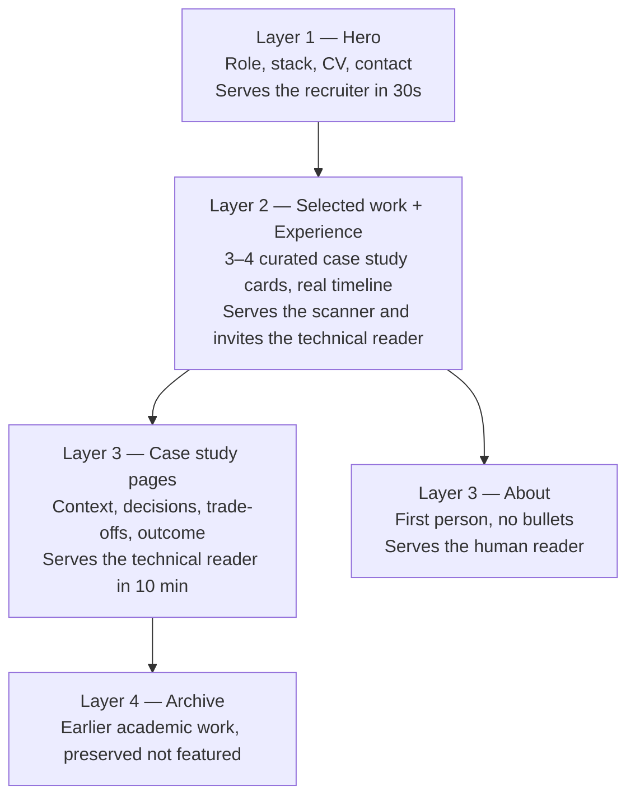

# v2 Vision — Positioning, Audience and Principles

**Status:** First draft. Written to be argued with.
**Scope:** What the 2026 portfolio is *for* and how it should feel. Deliberately
contains no implementation detail — that is in
[v2-architecture-options.md](v2-architecture-options.md) and
[v2-information-architecture.md](v2-information-architecture.md).

---

## 1. The shift

The 2023 portfolio was built to say:

> *"I am learning web development and I have built some things myself."*

**ASSESSMENT.** It said that well. It was hand-built, it demonstrated initiative,
it showed real work, and it was honest about being early-career. As an artefact
of a career change, it did its job.

The 2026 portfolio needs to say something structurally different:

> *"I work at the intersection of data, platform and software. I can take a
> problem from question to production, and here is the evidence."*

**ASSESSMENT.** The difference is not tone or polish. It is the type of claim.
The 2023 site made a **potential** claim — here is what I have learned, here is
what I could do. The 2026 site must make an **evidence** claim — here is what I
have built, here is what it does, here is what changed.

That reframing drives every recommendation in these documents. It is why the
Soft Skills section should go (self-declared potential), why the logo wall
should go (inventory of exposure, not evidence of use), and why one real
professional case study would be worth more than all six existing projects
combined.

### The narrower point about seniority

**ASSESSMENT.** There is a specific trap for people three years into a career:
continuing to present as "someone who has learned things" long after becoming
"someone who does things". The current site is deep in it — four occurrences of
the word "Junior", nine bullets of postgraduate module names, an accordion
explaining what Scrum is.

The 2026 version should not overcorrect into inflated seniority claims. It should
simply stop making the junior claim and let the work speak. Three years of
professional experience does not need a label; it needs specifics.

---

## 2. Positioning

**HUMAN INPUT REQUIRED.** The positioning statement itself cannot be written
without you. What follows is the *shape* it should take and the criteria it must
meet — not a draft to adopt.

### What a positioning statement must do

One sentence, readable in under four seconds, answering three questions
simultaneously:

1. **What are you?** A role, not a list of technologies.
2. **Where and at what level?** Context that makes the claim concrete and
   verifiable.
3. **What with?** Two or three technologies that genuinely define your work —
   not a comprehensive list.

### The shape, not the content

```
[Role] at [Employer]. I build [what] with [2–3 core technologies].
```

**ASSESSMENT.** The current site's hero — a name and "Junior Data Scientist" —
answers question one badly and questions two and three not at all. A visitor
learns nothing they can act on.

**ASSESSMENT.** Note that this statement then propagates: it becomes the hero,
the `<title>`, the meta description, the Open Graph description and the LinkedIn
preview. It is genuinely the highest-leverage sentence on the site, and it is
currently the word "Junior".

### Questions the positioning must resolve

**HUMAN INPUT REQUIRED.** These are genuine forks, not rhetorical:

1. **Which label?** "Data Engineer", "Integration Specialist", "Data & Analytics
   Engineer", "Data Platform Engineer" — or your actual internal title? Internal
   titles are honest but sometimes illegible outside the company. Generic titles
   are legible but can undersell.

2. **How prominent is the employer?** Naming Catalonia Hotels & Resorts makes the
   claim concrete and verifiable, and hospitality-sector data work is a genuine
   differentiator. But it also anchors you to one sector.

3. **How much does AI feature?** You describe AI as one of your main tools. There
   is a real trade-off: AI is what everyone is currently claiming, so leading
   with it risks blending in, while a data-platform-plus-AI combination backed by
   production experience is more distinctive than either alone.

4. **Does the chemistry background stay?** It is unusual and memorable, and
   career-change stories are interesting. It is also increasingly irrelevant
   after three years in the field, and it currently occupies prime position. My
   inclination is that it becomes a single line in a timeline rather than a
   headline — but it is your story.

---

## 3. Audiences

Three readers, with incompatible needs. The site must serve all three without
compromising into blandness.

### 3.1 The recruiter — 30 to 60 seconds

**Reads:** The hero. Maybe one project title. Looks for the CV link.

**Needs:** Current role and seniority, core technologies, location and
availability signal, a downloadable CV, a way to make contact.

**ASSESSMENT of the current site against this reader:** Fails. In 60 seconds
they learn a name, the word "Junior", and two degrees. The CV requires
discovering that a card is clickable, clicking it, then clicking again to reach a
third panel. Most will not get there.

**Design consequence.** Everything this reader needs must be above the fold or
one click away, and the CV must be permanently reachable. This reader will not
explore.

### 3.2 The technical reader — 3 to 10 minutes

**Who:** An engineering manager, a lead, a peer. Possibly evaluating you,
possibly just curious.

**Reads:** One or two projects properly. Looks for reasoning, not results. May
open the source repository.

**Needs:** Evidence of judgement. What was the constraint, what did you choose,
what did you reject, what broke, what would you do differently. Honest scope —
what you personally did versus the team.

**ASSESSMENT of the current site against this reader:** Partially succeeds and
partially fails. The project articles are well written and explain their
reasoning, which is exactly right. But they explain *textbook* reasoning — what
K-NN is, why even k values are awkward — rather than *engineering* reasoning:
why this approach for this problem, what the alternatives were, what the
trade-offs cost. They read as good teaching, not as evidence of professional
judgement.

**Design consequence.** Project pages should be case studies with a consistent
structure, not tutorials. This reader values "we chose X over Y because Z, and
here is where that hurt" far above a clean success story. Admitting a limitation
is a credibility signal, not a weakness.

### 3.3 The human reader — variable

**Who:** A future colleague, someone you have just met, someone deciding whether
you would be good to work with.

**Reads:** The About section. Skims everything else.

**Needs:** Some sense that a person wrote this. What you find interesting. Why
you moved from chemistry to data. What you care about.

**ASSESSMENT of the current site against this reader:** One sentence — "Data,
cheese and dogs lover" — and it is buried on the front of a flip card, in a
paragraph that immediately undercuts it. Everything else is credentials.

**Design consequence.** Reserve one section for actual voice, written in first
person, with no bullet points. This is also the strongest available
differentiator: technically competent portfolios are common, and the thing that
makes someone memorable is usually not the tech stack.

### 3.4 Resolving the conflict

**ASSESSMENT.** These three readers want opposite things — brevity, depth, and
personality. Trying to satisfy all three in one register produces a site that
satisfies none.

**RECOMMENDATION.** Do not compromise; **layer**. Depth should be optional and
progressively disclosed, not averaged.



Each layer must be complete on its own. A visitor who reads only layer one should
leave with an accurate impression, not a partial one.

---

## 4. What the portfolio is for

**HUMAN INPUT REQUIRED.** You are not job-hunting, which changes the goal
substantially and is worth being deliberate about. Plausible purposes, which lead
to different sites:

| Purpose | What it implies |
|---|---|
| **Professional presence** — something credible when someone searches your name | Optimise for the 60-second read and for search. Keep it small and current. |
| **Insurance** — ready if you ever do want to move | Optimise for the recruiter and depth of evidence. Update it twice a year. |
| **A place to write** — publish thinking about data platform work | Add a notes/writing section. This changes the architecture requirements most. |
| **Proof of craft** — demonstrate you can still build things | The site itself becomes a work sample. Quality of execution matters more than content volume. |
| **Personal satisfaction** — you enjoy building it | Permission to over-engineer selectively, for fun. |

**ASSESSMENT.** These are not mutually exclusive, but they do rank. My reading of
your brief — "keep my CV and professional presence up to date", "not currently
looking to change jobs" — suggests presence first, insurance second, craft third.
If that is right, the implication is a **small, current, high-quality site rather
than a comprehensive one**, and the maintenance cost of updating it must be
close to zero, because a site that is expensive to update will go stale again.

**ASSESSMENT.** That last point is the lesson of the 2023 site, and it is
worth stating plainly: **it did not go stale because you lost interest. It went
stale because updating it cost a code change.** Whatever v2 becomes, if adding a
project or editing a paragraph is not trivially easy, it will be out of date by
2028.

---

## 5. Tone

### What it should sound like

**Direct.** State what you did. "I built a pipeline that ingests X" rather than
"I was involved in the development of solutions relating to X".

**Specific.** Numbers, names, constraints. "Twelve source systems" beats
"multiple data sources". Specificity is the cheapest available credibility.

**Honest about scope.** "I owned the ingestion layer; the modelling was a
colleague's" is more convincing than an implied claim to everything. Technical
readers notice inflated scope immediately.

**Plain.** Short sentences. No "leveraging", no "utilising", no "passionate
about". If a simpler word exists, use it. This applies in all three languages.

**Occasionally personal.** One section with actual voice. Not throughout — a
portfolio that is relentlessly casual is as tiring as one that is relentlessly
corporate.

**Comfortable with limitations.** "This approach did not scale past X, and here
is what I would do instead" is the single strongest signal of experience
available in written form.

### What it should not sound like

**Not a CV in HTML.** Bullet points of responsibilities are what LinkedIn is
for. A portfolio should do the thing a CV cannot: explain reasoning.

**Not a tutorial.** The current project pages teach K-NN from first principles.
Written for a technical peer, that inverts the expertise relationship. Explain
your *decisions*, not the *fundamentals*.

**Not breathless.** No "cutting-edge", no "innovative", no "passionate about
leveraging data to drive insights". Every portfolio says this and none of it
carries information.

**Not falsely modest either.** "Just a small project" undersells work that took
real effort. Describe it accurately and let the reader judge.

### On three languages

**FACT.** You have chosen to keep Catalan, Spanish and English.

**ASSESSMENT.** Tone must survive translation, and it currently does not — the
English copy says "Data, cheese and dogs lover" while the Spanish and Catalan
mention only cheese. Personality that exists in one language and not the others
means two thirds of visitors meet a blander version of you.

**RECOMMENDATION.** Write in one language first, deliberately, then translate
that voice rather than translating word-for-word. Where a phrase does not
survive, find the local equivalent rather than dropping it. If a piece of content
genuinely cannot be maintained in all three, it is better to say so explicitly
than to ship an untranslated copy — which is precisely the failure mode of the
current site.

---

## 6. Principles

Nine principles, in priority order. Where two conflict, the higher one wins.

### 1. Substance over surface

Content and evidence decide quality, not visual effects. If a design choice does
not help a reader understand something, it is decoration. Decoration is allowed
but never at the cost of clarity.

*Test:* would this still be a good portfolio as plain text?

### 2. Curate, do not accumulate

Three excellent projects beat eight adequate ones. Every additional item dilutes
the average and costs the reader attention. The current site shows six projects
including two near-identical K-means analyses.

*Test:* if I could only show three things, would this be one of them?

### 3. Show judgement, not just output

Anyone can produce a chart. Explaining why this approach, what was rejected, and
what it cost is what distinguishes three years of experience from three months.

*Test:* does this page contain a decision, or only a result?

### 4. Cheap to update

The v2 site must make publishing trivial. Adding a project should mean writing a
file, not editing components, styles and three translation files. This is the
principle that determines whether the site is still current in 2028.

*Test:* can I add a project in ten minutes without opening a component?

### 5. Honest by construction

No inflated claims, no implied ownership of team work, no listing technologies
used once. Where something is uncertain or incomplete, say so. The system should
also make dishonesty *hard* — for example, a build that fails when a translation
is missing rather than silently shipping a duplicate.

*Test:* would I be comfortable if a colleague from that project read this?

### 6. Accessible and fast as a baseline

Not features to add later. Real alt text, keyboard operability, sufficient
contrast, working focus states, sensible payload. The current site has 82 images
with no meaningful alt text, a keyboard-unreachable language switcher and a
9.7 MB logo — all of which is also, incidentally, a competence signal in itself.

*Test:* does this work with a keyboard, and would I ship it on a phone
connection?

### 7. Content in the URL

Every page, every language, every project must have its own address that can be
shared, bookmarked and indexed. The current site fails this comprehensively:
project pages 404 on direct access and language is invisible to the URL, so two
of three translations cannot be shared or found.

*Test:* can I paste this link into a message and have it work?

### 8. Durable over impressive

Prefer things that will still work in three years. A live demo on someone else's
free tier is not durable — two of the six current projects died silently when
Streamlit changed its access policy. Write-ups and source links outlive hosted
demos.

*Test:* if this third-party service disappeared, would the page still make
sense?

### 9. Small enough to finish

The 2023 site stopped mid-way through translating three articles. An ambitious
v2 that is 70% complete is worse than a modest v2 that is finished. Scope to what
can actually be completed and maintained by one person who has a full-time job.

*Test:* can I finish this in the time I actually have?

---

## 7. Explicit non-goals

Stating what v2 should *not* try to be, to prevent scope creep.

- **Not a comprehensive archive.** Not everything you have built belongs on it.
- **Not a blog you will not write.** Do not build a blog section on the theory
  that you will fill it. Add it when there are two or three posts ready.
- **Not a technology demonstration.** The site should not exist to prove you know
  a framework. If it is beautifully built, good — but nobody is hiring based on
  your CSS.
- **Not a design showcase.** You are not a designer and the site should not
  pretend otherwise. Clean, restrained and confident beats ambitious and
  slightly off.
- **Not exhaustive about the past.** The chemistry degree, the postgraduate
  modules and the bootcamp can be compressed to three lines without loss.
- **Not permanently in progress.** It should reach a state where it is *done*,
  and then be updated occasionally. "Under construction" is worse than modest and
  finished.

---

## 8. Success criteria

Concrete tests to judge v2 against when it exists.

1. **The 30-second test.** A stranger reads only the first screen and can
   correctly state your role, your domain and two technologies you work with.
2. **The correction test.** Nobody who reads it comes away thinking you are
   junior or a recent graduate.
3. **The depth test.** A technical reader finds at least one page that shows real
   engineering judgement, including at least one acknowledged limitation.
4. **The person test.** A reader can name one thing about you that is not a
   technology.
5. **The share test.** Every project page and every language has a working URL
   that produces a proper preview when pasted into LinkedIn.
6. **The maintenance test.** Adding a project takes under thirty minutes and
   requires editing no component.
7. **The staleness test.** If the site were untouched for two years, would it
   still be roughly accurate? If not, the content is too time-specific.
8. **The keyboard test.** The entire site is operable without a mouse, including
   the language switcher.
9. **The phone test.** It loads acceptably on a mobile connection and is
   comfortable to read on a small screen.
10. **The honesty test.** Every claim could be defended in an interview with
    specifics.

**ASSESSMENT.** Criteria 1, 2 and 4 are content problems and are the ones that
matter most. Criteria 5, 6, 8 and 9 are architecture problems, and they are the
ones the current site fails structurally rather than incidentally.

---

## HUMAN INPUT REQUIRED

Collected from throughout this document. These block the v2 content, though not
the v2 architecture decision.

1. **Your one-line positioning statement.** Role, employer prominence, core
   technologies. The single highest-leverage decision.
2. **The primary purpose** of the site — presence, insurance, writing, craft, or
   enjoyment. Determines scope.
3. **How much of your professional work can be described publicly,** and at what
   level of detail.
4. **Whether the chemistry background is a headline or a footnote.**
5. **How prominently AI features** relative to data platform and integration
   work.
6. **Whether you want a writing section,** and honestly whether you will use it.
7. **How much personality you want,** and in which sections.
8. **How often you realistically expect to update the site** — this determines
   how much automation is worth building.
